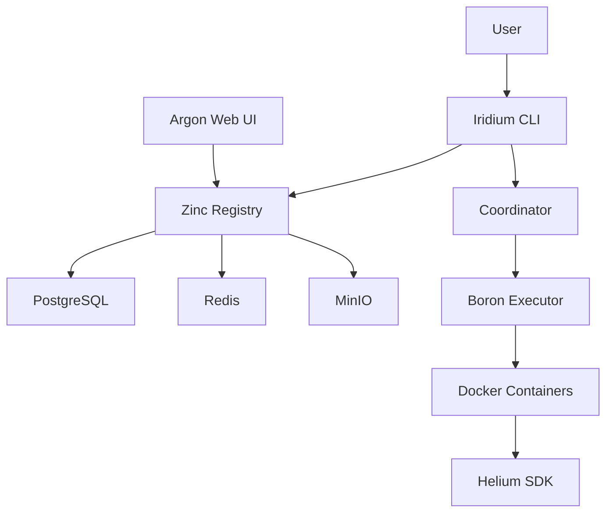

# Platform Architecture

CyanPrint is a sophisticated template management and execution platform designed to streamline project scaffolding through isolated, secure template execution.

## Platform Overview

CyanPrint enables developers to create, share, and execute project templates with consistent, reproducible results. The platform addresses key challenges in template management:

- **Security**: Templates execute in isolated Docker containers, preventing malicious code from affecting the host system
- **Reproducibility**: Deterministic template execution ensures consistent output across different environments
- **Extensibility**: Plugin architecture allows custom processors and template enhancements
- **Collaboration**: Centralized registry enables template sharing across teams and organizations

## Architecture Diagram

The following diagram illustrates the high-level architecture of the CyanPrint platform:

## Component Overview

### Iridium CLI

The primary interface for users, built in Rust for performance and reliability. It provides:

- Template discovery and search
- Template execution orchestration
- Local development workflows
- Registry authentication

### Zinc Registry

The central registry service, built on .NET 8, providing:

- Template storage and versioning via MinIO
- Metadata management via PostgreSQL
- Caching layer via Redis
- REST API for template operations

### Boron Executor

The isolated execution environment using Docker to:

- Run templates in sandboxed containers
- Manage resource limits and timeouts
- Handle file system isolation
- Provide secure network policies

### Argon Web UI

The web-based management interface, built with SvelteKit, offering:

- Template browsing and discovery
- Organization and team management
- Usage analytics and insights
- Administrative controls

### Helium SDK

Multi-language SDKs (TypeScript, .NET, Python) that enable:

- Template development
- Custom processor creation
- Plugin development
- Testing utilities

## Data Flow

When a user executes a template, the following sequence occurs:

1. **CLI Command**: User runs a command like `cyanprint init my-project` through the Iridium CLI
2. **Template Resolution**: CLI queries the Zinc Registry to fetch template metadata and configuration
3. **Execution Planning**: The Coordinator component creates an execution plan, determining which processors and plugins are needed
4. **Container Scheduling**: Boron Executor receives the execution plan and schedules a Docker container with appropriate resources
5. **Template Execution**: Inside the container, the Helium SDK runs the template logic, generating files based on user inputs
6. **Output Delivery**: Generated files are copied from the container to the user's local filesystem

## Key Technologies

| Component   | Technology Stack                          |
| ----------- | ----------------------------------------- |
| Zinc        | .NET 8, PostgreSQL, Redis, MinIO          |
| Argon       | SvelteKit, TypeScript                     |
| Iridium     | Rust, Tokio                               |
| Boron       | Docker, Containerd                        |
| Helium SDKs | TypeScript, .NET, Python                  |

## Repository Links

For detailed information about each component, refer to the [Repositories](./02-repositories) page or visit the individual repositories:

- [zinc](https://github.com/AtomiCloud/cyanprint.zinc) - Registry API
- [argon](https://github.com/AtomiCloud/cyanprint.argon) - Web UI
- [iridium](https://github.com/AtomiCloud/cyanprint.iridium) - CLI
- [boron](https://github.com/AtomiCloud/cyanprint.boron) - Executor
- [helium](https://github.com/AtomiCloud/cyanprint.helium) - SDKs
