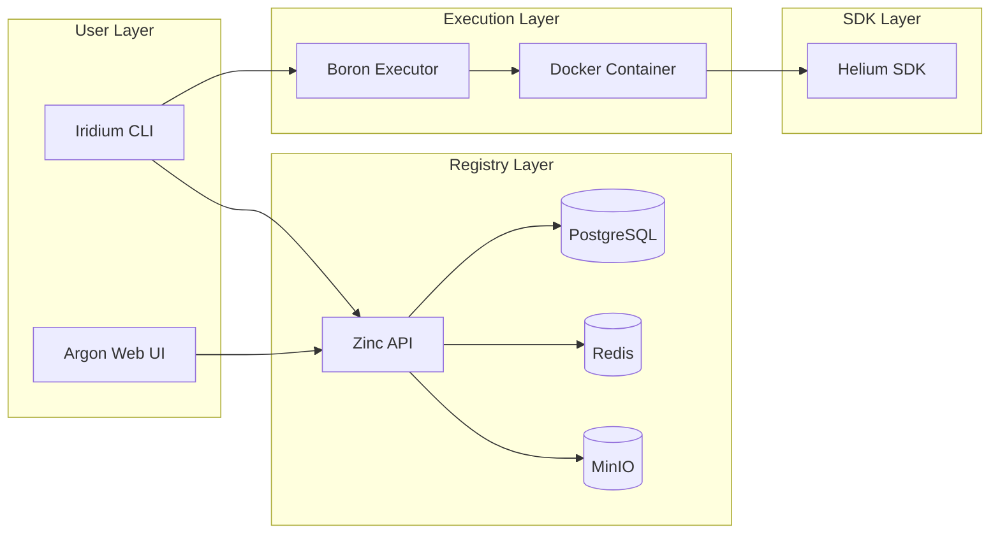

# Repository Index

CyanPrint is organized as a polyglot monorepo ecosystem with five primary repositories. This page provides an overview of each repository, its purpose, and how it fits into the overall platform.

## Repository Overview

| Repository                                         | Language           | Purpose                                         | Documentation                                              |
| -------------------------------------------------- | ------------------ | ----------------------------------------------- | ---------------------------------------------------------- |
| [zinc](#zinc)                                      | .NET 8             | Registry API (PostgreSQL, Redis, MinIO)         | [README](https://github.com/AtomiCloud/cyanprint.zinc)     |
| [argon](#argon)                                    | SvelteKit          | Registry Web UI                                 | [README](https://github.com/AtomiCloud/cyanprint.argon)    |
| [iridium](#iridium)                                | Rust               | Main CLI (cyanprint, coordinator, prompt, registry) | [Docs](https://github.com/AtomiCloud/cyanprint.iridium/tree/main/docs) |
| [boron](#boron)                                    | Docker             | Isolated template execution                     | [README](https://github.com/AtomiCloud/cyanprint.boron)    |
| [helium](#helium)                                  | TS/.NET/Python     | SDKs for templates, processors, plugins         | [Docs](https://github.com/AtomiCloud/cyanprint.helium)     |

---

## Zinc

**GitHub**: [AtomiCloud/cyanprint.zinc](https://github.com/AtomiCloud/cyanprint.zinc)

The Zinc repository contains the central registry API service. It serves as the backbone of the CyanPrint platform, managing template metadata, versioning, and distribution.

### Tech Stack

- **Runtime**: .NET 8
- **Database**: PostgreSQL
- **Caching**: Redis
- **Object Storage**: MinIO
- **API Framework**: ASP.NET Core

### Key Features

- Template upload and versioning
- Organization and team management
- Access control and permissions
- Template search and discovery
- Usage analytics

### How It Integrates

Zinc receives template uploads from developers, stores template artifacts in MinIO, manages metadata in PostgreSQL, and uses Redis for caching frequently accessed data. Both Iridium CLI and Argon Web UI communicate with Zinc's REST API.

---

## Argon

**GitHub**: [AtomiCloud/cyanprint.argon](https://github.com/AtomiCloud/cyanprint.argon)

Argon is the web-based user interface for the CyanPrint registry. It provides a visual interface for browsing, discovering, and managing templates.

### Tech Stack

- **Framework**: SvelteKit
- **Language**: TypeScript
- **Styling**: TailwindCSS
- **Build**: Vite

### Key Features

- Template browsing and search
- Organization dashboard
- Team management interface
- Usage statistics and analytics
- Administrative controls

### How It Integrates

Argon communicates with the Zinc API to fetch template data, user permissions, and organizational information. It provides a user-friendly layer over the Zinc API for non-CLI users.

---

## Iridium

**GitHub**: [AtomiCloud/cyanprint.iridium](https://github.com/AtomiCloud/cyanprint.iridium)

Iridium is the primary command-line interface for CyanPrint. It's built in Rust for performance, reliability, and cross-platform support.

### Tech Stack

- **Language**: Rust
- **Async Runtime**: Tokio
- **CLI Framework**: Clap

### Key Features

- Template execution (`cyanprint init`)
- Template discovery and search
- Local template development
- Registry authentication
- Configuration management

### Sub-components

- **cyanprint**: Main CLI entry point
- **coordinator**: Execution orchestration
- **prompt**: Interactive prompting system
- **registry**: Registry client implementation

### How It Integrates

Iridium connects to Zinc for template discovery and download, then coordinates with Boron for isolated execution. It handles user interaction and manages the local file system for output.

---

## Boron

**GitHub**: [AtomiCloud/cyanprint.boron](https://github.com/AtomiCloud/cyanprint.boron)

Boron is the isolated execution engine for templates. It uses Docker to run templates in sandboxed containers, ensuring security and reproducibility.

### Tech Stack

- **Container Runtime**: Docker
- **Orchestration**: Custom scheduler
- **Networking**: Isolated networks

### Key Features

- Container lifecycle management
- Resource limits (CPU, memory, time)
- File system isolation
- Network policies
- Execution logging

### How It Integrates

Boron receives execution requests from the Iridium Coordinator, pulls appropriate container images, mounts necessary volumes, executes the template, and returns generated files.

---

## Helium

**GitHub**: [AtomiCloud/cyanprint.helium](https://github.com/AtomiCloud/cyanprint.helium)

Helium provides SDKs for template development in multiple languages. It enables developers to create templates, processors, and plugins.

### Tech Stack

- **TypeScript SDK**: Node.js ecosystem
- **.NET SDK**: .NET 8
- **Python SDK**: Python 3.8+

### Key Features

- Template API abstractions
- Processor development utilities
- Plugin interfaces
- Testing utilities
- Type definitions

### How It Integrates

Helium SDKs are used inside the Boron execution containers. Templates built with Helium interact with the container environment to generate output files based on user inputs.

---

## Cross-Repository Interactions

## Development Setup

For information on setting up a local development environment that spans multiple repositories, refer to the [Architecture](./01-architecture) page for data flow understanding and individual repository documentation for specific setup instructions.
