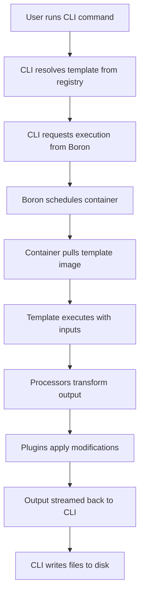
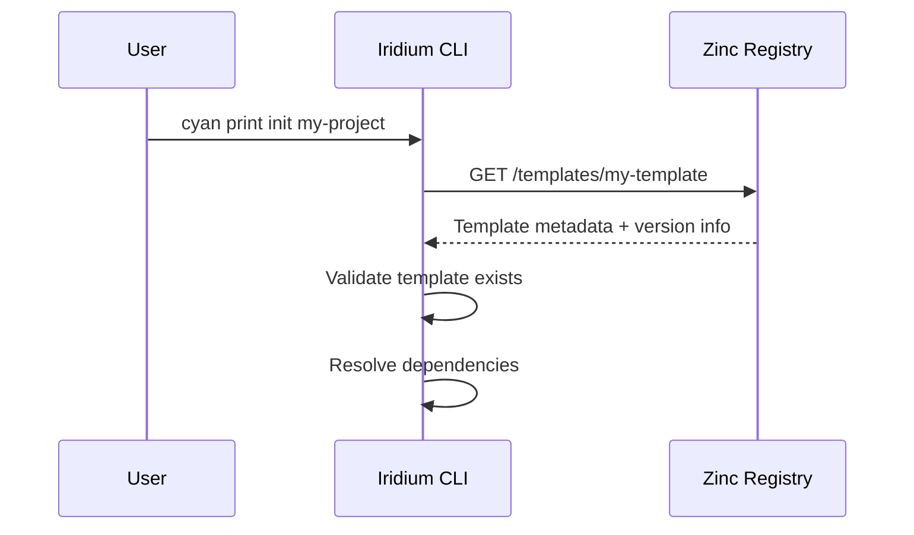
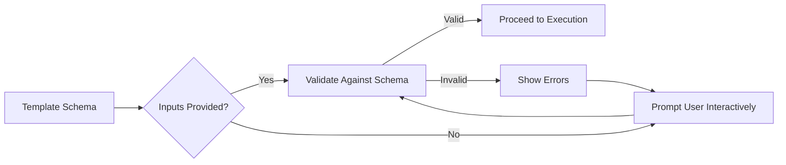
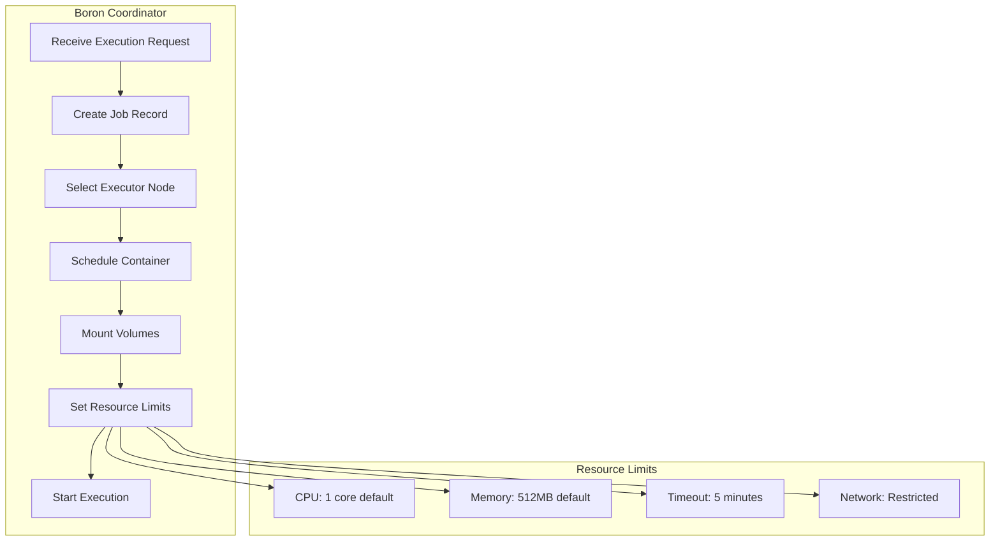
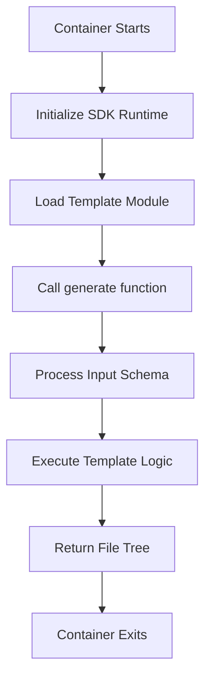
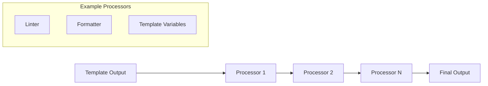
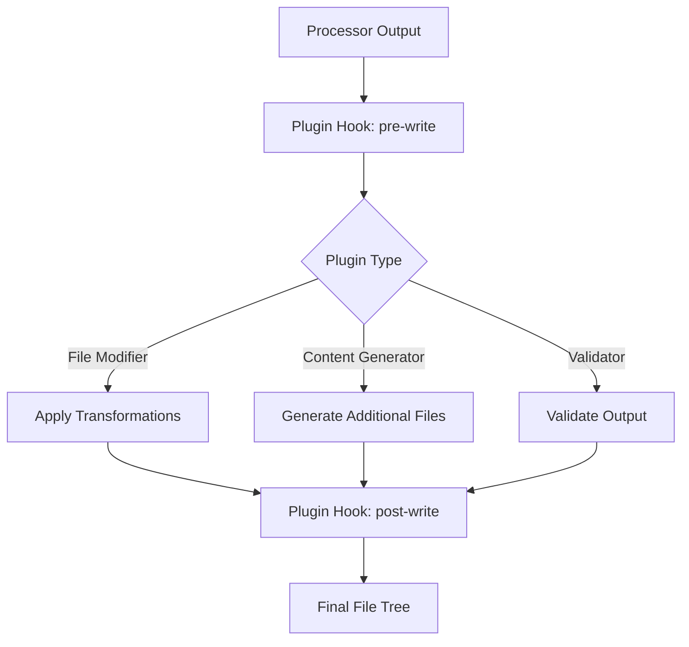
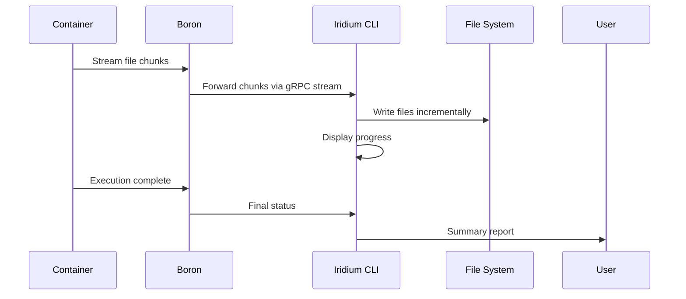
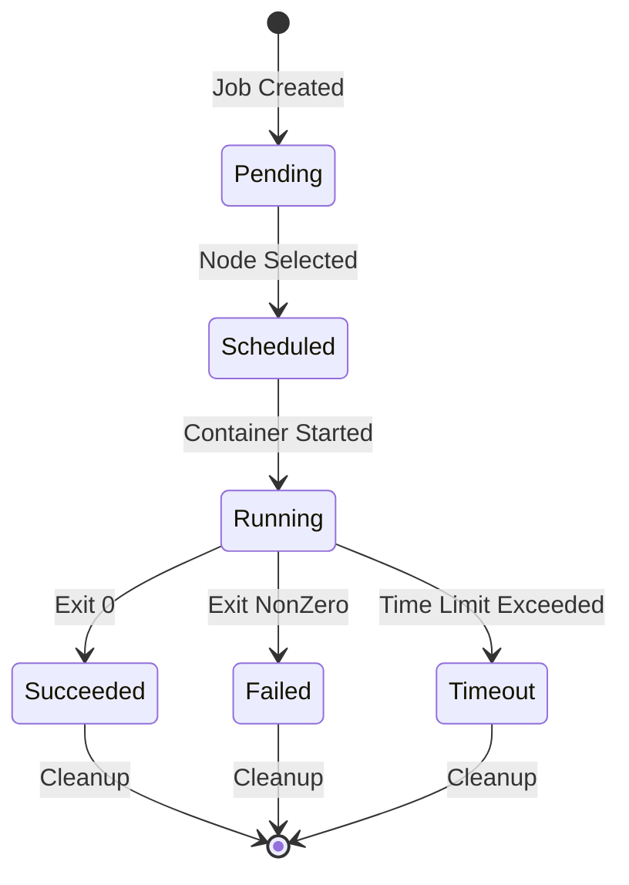

# Execution Flow

This document explains how CyanPrint executes templates, processors, and plugins through the Boron coordinator using containerized environments.

## Overview

When a user runs a command like `cyan print init my-project`, the following high-level flow occurs:



## Detailed Execution Phases

### Phase 1: Template Resolution

The CLI first resolves the requested template:



During this phase:
1. The template identifier is parsed (name, version, registry)
2. Template metadata is fetched from the Zinc registry
3. Dependencies are resolved transitively
4. Input schema is retrieved for validation

### Phase 2: Input Collection

Once the template is resolved, inputs are collected:



Input sources (in order of priority):
1. Command-line flags (`--input key=value`)
2. Input files (`--input-file inputs.yaml`)
3. Environment variables (`CYAN_INPUT_KEY`)
4. Interactive prompts

### Phase 3: Container Scheduling

Boron manages container execution:



### Phase 4: Template Execution

Inside the container, the template executes:



The template uses the Helium SDK to:
1. Access validated inputs
2. Generate files and directories
3. Set file permissions and metadata
4. Return a virtual file tree

### Phase 5: Processor Pipeline

Processors transform the template output:



Common processor types:
- **Formatters**: Apply code formatting (Prettier, Biome, etc.)
- **Linters**: Check code quality and fix issues
- **Transformers**: Modify file contents based on rules
- **Validators**: Ensure output meets requirements

### Phase 6: Plugin Application

Plugins can modify the final output:



### Phase 7: Output Streaming

Results are streamed back to the client:



## Container Lifecycle



## Error Handling

| Stage | Error Type | Handling |
| ----- | ---------- | -------- |
| Resolution | Template not found | Return error with suggestions |
| Resolution | Version conflict | Show dependency tree, suggest resolution |
| Input | Validation failed | Display errors, prompt for correction |
| Execution | Container OOM | Increase limits, retry with larger container |
| Execution | Timeout | Show partial output, suggest optimization |
| Processing | Processor failed | Continue with remaining processors, warn user |
| Output | Write failure | Retry with elevated permissions, suggest manual path |

## Resource Management

Default resource limits can be configured:

```yaml
# boron-config.yaml
execution:
  defaults:
    cpu_limit: "1"
    memory_limit: "512Mi"
    timeout: "5m"
    network_enabled: false

  # Per-template overrides
  templates:
    heavy-template:
      cpu_limit: "2"
      memory_limit: "2Gi"
      timeout: "15m"
```

## Next Steps

- Learn about specific [Repositories](/docs/contributor/repositories)
- Set up your [Development Environment](/docs/contributor/development/setup)
- Return to [Architecture Overview](/docs/contributor/architecture/overview)
