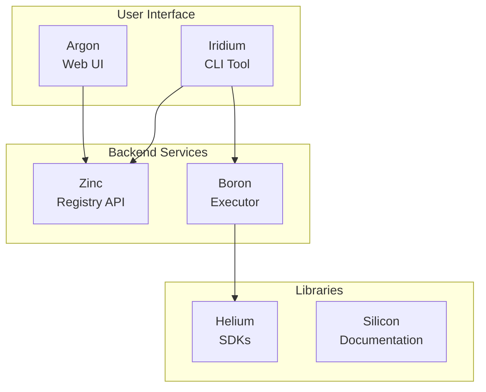

# CyanPrint Repositories

CyanPrint is organized as a monorepo-style project with separate repositories for each component. This page provides an overview of all repositories and their purposes.

## Repository Overview

## All Repositories

| Repository | Tech Stack | Purpose | Status |
| ---------- | ---------- | ------- | ------ |
| [sulfone.iridium](https://github.com/AtomiCloud/sulfone.iridium) | Rust, Clap | CLI tool for end users | Active |
| [sulfone.boron](https://github.com/AtomiCloud/sulfone.boron) | Rust, Tokio | Execution coordinator | Active |
| [sulfone.zinc](https://github.com/AtomiCloud/sulfone.zinc) | Rust, Axum | Registry API server | Active |
| [sulfone.argon](https://github.com/AtomiCloud/sulfone.argon) | TypeScript, React | Web UI for registry | Active |
| [sulfone.helium](https://github.com/AtomiCloud/sulfone.helium) | TypeScript, Python, C# | SDKs for template development | Active |
| [sulfone.silicon](https://github.com/AtomiCloud/sulfone.silicon) | TypeScript, Next.js | Documentation site | Active |

## Repository Details

### Iridium (CLI)

The command-line interface that users interact with directly.

- **Language**: Rust
- **Framework**: Clap
- **Key Features**: Project scaffolding, template management, configuration

[View Iridium Documentation →](/docs/contributor/repositories/iridium)

### Boron (Executor)

The execution coordinator that manages container-based template execution.

- **Language**: Rust
- **Framework**: Tokio
- **Key Features**: Container orchestration, resource management, job scheduling

[View Boron Documentation →](/docs/contributor/repositories/boron)

### Zinc (Registry API)

The registry API that stores template metadata and handles authentication.

- **Language**: Rust
- **Framework**: Axum
- **Key Features**: Template registry, versioning, authentication

[View Zinc Documentation →](/docs/contributor/repositories/zinc)

### Argon (Web UI)

The web-based user interface for browsing and managing templates.

- **Language**: TypeScript
- **Framework**: React, Next.js
- **Key Features**: Template browsing, search, user management

[View Argon Documentation →](/docs/contributor/repositories/argon)

### Helium (SDKs)

Multi-language SDKs for developing templates, processors, and plugins.

- **Languages**: TypeScript, Python, C#
- **Key Features**: Type-safe APIs, input validation, file generation

[View Helium Documentation →](/docs/contributor/repositories/helium)

## Development Setup

To contribute to any CyanPrint repository:

1. Fork the repository on GitHub
2. Clone your fork locally
3. Follow the setup instructions in the repository's README
4. Make your changes and submit a pull request

For detailed setup instructions, see the [Development Setup Guide](/docs/contributor/development/setup).

## Contributing Guidelines

Each repository has its own contributing guidelines, but general principles apply:

- Follow the code style defined in each repository
- Write tests for new functionality
- Update documentation as needed
- Submit pull requests against the `main` branch
- Ensure CI passes before requesting review
