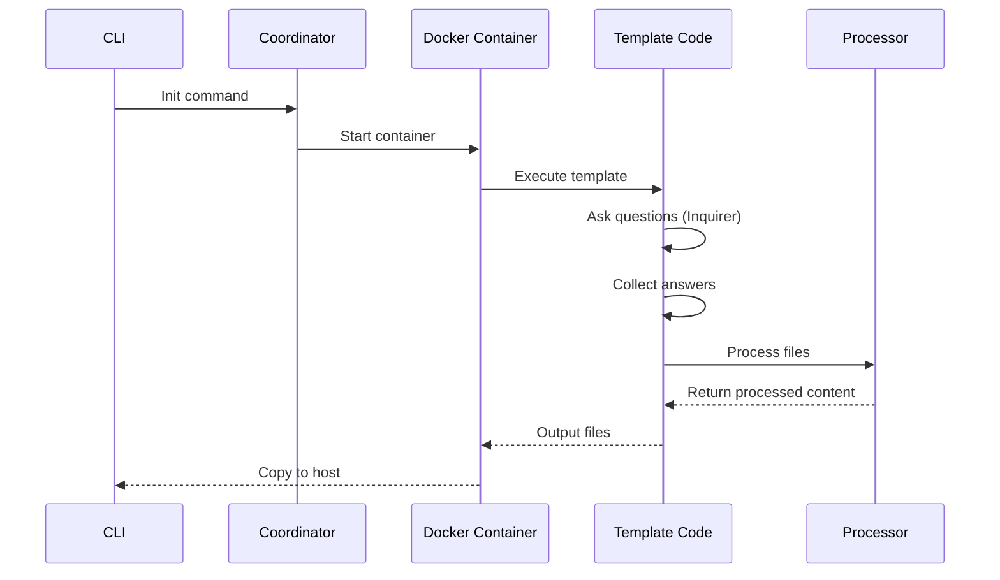

# Core Concepts

Before diving into template development, it's essential to understand the core concepts that power CyanPrint. These concepts are consistent across all three SDK languages.

## The Cyan Object

The **Cyan object** is the primary interface for interacting with the CyanPrint runtime. It provides access to all the tools and data needed during template execution.

import { Tab, Tabs } from 'fumadocs-ui/components/tabs';

<Tabs groupId="sdk-language" items={['TypeScript', '.NET', 'Python']} persist>
  <Tab value="TypeScript">

```ts
import { Cyan, ICyanTemplate } from '@atomicloud/helium-sdk';

export default class MyTemplate implements ICyanTemplate {
  async execute(cyan: Cyan): Promise<void> {
    // Access glob patterns
    const files = cyan.glob('**/*.ts');

    // Access user answers
    const name = cyan.answers.projectName;

    // Access inquirer for questions
    const response = await cyan.inquirer.text('Enter value:');

    // Access determinism for random values
    const id = cyan.determinism.uuid();
  }
}
```

  </Tab>
  <Tab value=".NET">

```csharp
using AtomiCloud.Helium;

public class MyTemplate : ICyanTemplate
{
    public async Task ExecuteAsync(Cyan cyan)
    {
        // Access glob patterns
        var files = cyan.Glob("**/*.cs");

        // Access user answers
        var name = cyan.Answers["projectName"];

        // Access inquirer for questions
        var response = await cyan.Inquirer.TextAsync("Enter value:");

        // Access determinism for random values
        var id = cyan.Determinism.Uuid();
    }
}
```

  </Tab>
  <Tab value="Python">

```python
from helium_sdk import Cyan, ICyanTemplate

class MyTemplate(ICyanTemplate):
    async def execute(self, cyan: Cyan):
        # Access glob patterns
        files = cyan.glob("**/*.py")

        # Access user answers
        name = cyan.answers["projectName"]

        # Access inquirer for questions
        response = await cyan.inquirer.text("Enter value:")

        # Access determinism for random values
        id = cyan.determinism.uuid()
```

  </Tab>
</Tabs>

## Glob Patterns

Glob patterns are used to select files for processing. CyanPrint uses standard glob syntax with the following key patterns:

| Pattern | Description | Example |
| ------- | ----------- | ------- |
| `*` | Matches any single segment | `src/*.ts` matches `src/index.ts` |
| `**` | Matches any number of segments | `**/*.ts` matches all `.ts` files |
| `**/*` | Matches all files recursively | `src/**/*` matches everything under `src` |
| `!` | Negation/exclusion | `**/*.ts` followed by `!**/*.test.ts` |

### Using Globs in Templates

<Tabs groupId="sdk-language" items={['TypeScript', '.NET', 'Python']} persist>
  <Tab value="TypeScript">

```ts
// Get all TypeScript files
const tsFiles = cyan.glob('**/*.ts');

// Get all files in src directory
const srcFiles = cyan.glob('src/**/*');

// Get files with exclusion
const files = cyan.glob(['**/*', '!**/*.test.ts']);
```

  </Tab>
  <Tab value=".NET">

```csharp
// Get all C# files
var csFiles = cyan.Glob("**/*.cs");

// Get all files in src directory
var srcFiles = cyan.Glob("src/**/*");

// Get files with exclusion
var files = cyan.Glob(new[] { "**/*", "!**/*.Test.cs" });
```

  </Tab>
  <Tab value="Python">

```python
# Get all Python files
py_files = cyan.glob("**/*.py")

# Get all files in src directory
src_files = cyan.glob("src/**/*")

# Get files with exclusion
files = cyan.glob(["**/*", "!**/*_test.py"])
```

  </Tab>
</Tabs>

## Inquirer

The **Inquirer** provides interactive prompts for collecting user input. Templates use inquirer to ask questions during execution, making them dynamic and configurable.

### Question Types

| Type | Description | Use Case |
| ---- | ----------- | -------- |
| `text` | Free-form text input | Project names, descriptions |
| `select` | Single selection from list | Framework choice, language |
| `checkbox` | Multiple selections | Feature selection, optional packages |
| `confirm` | Yes/No confirmation | Enable optional features |
| `password` | Masked text input | API keys, tokens |
| `date` | Date picker | Version dates, expiration dates |

### Asking Questions

<Tabs groupId="sdk-language" items={['TypeScript', '.NET', 'Python']} persist>
  <Tab value="TypeScript">

```ts
// Text input
const name = await cyan.inquirer.text({
  message: 'Project name:',
  default: 'my-project'
});

// Single selection
const framework = await cyan.inquirer.select({
  message: 'Choose a framework:',
  options: ['React', 'Vue', 'Svelte']
});

// Multiple selections
const features = await cyan.inquirer.checkbox({
  message: 'Select features:',
  options: ['TypeScript', 'ESLint', 'Prettier']
});

// Confirmation
const useGit = await cyan.inquirer.confirm({
  message: 'Initialize git repository?',
  default: true
});
```

  </Tab>
  <Tab value=".NET">

```csharp
// Text input
var name = await cyan.Inquirer.TextAsync(new TextOptions
{
    Message = "Project name:",
    Default = "my-project"
});

// Single selection
var framework = await cyan.Inquirer.SelectAsync(new SelectOptions
{
    Message = "Choose a framework:",
    Options = new[] { "React", "Vue", "Svelte" }
});

// Multiple selections
var features = await cyan.Inquirer.CheckboxAsync(new CheckboxOptions
{
    Message = "Select features:",
    Options = new[] { "TypeScript", "ESLint", "Prettier" }
});

// Confirmation
var useGit = await cyan.Inquirer.ConfirmAsync(new ConfirmOptions
{
    Message = "Initialize git repository?",
    Default = true
});
```

  </Tab>
  <Tab value="Python">

```python
# Text input
name = await cyan.inquirer.text(
    message="Project name:",
    default="my-project"
)

# Single selection
framework = await cyan.inquirer.select(
    message="Choose a framework:",
    options=["React", "Vue", "Svelte"]
)

# Multiple selections
features = await cyan.inquirer.checkbox(
    message="Select features:",
    options=["TypeScript", "ESLint", "Prettier"]
)

# Confirmation
use_git = await cyan.inquirer.confirm(
    message="Initialize git repository?",
    default=True
)
```

  </Tab>
</Tabs>

## Determinism

**Determinism** ensures templates produce identical output when given the same inputs, even when using operations that are normally random. This is crucial for reproducible builds.

### Why Determinism Matters

<Callout type="info">
Templates execute in containers that may have varying random number generators. The determinism system provides seeded random generation that produces consistent results across all execution environments.
</Callout>

### Deterministic Operations

| Operation | Description |
| --------- | ----------- |
| `uuid()` | Generate a deterministic UUID |
| `random()` | Generate a random number 0-1 |
| `randomInt(min, max)` | Generate a random integer in range |
| `randomString(length)` | Generate a random string |
| `shuffle(array)` | Shuffle an array deterministically |
| `pick(array)` | Pick a random element from array |

### Using Determinism

<Tabs groupId="sdk-language" items={['TypeScript', '.NET', 'Python']} persist>
  <Tab value="TypeScript">

```ts
// Generate deterministic UUID
const id = cyan.determinism.uuid();

// Generate random number in range
const port = cyan.determinism.randomInt(3000, 9999);

// Generate random string
const secret = cyan.determinism.randomString(32);

// Shuffle array deterministically
const shuffled = cyan.determinism.shuffle(['a', 'b', 'c', 'd']);

// Pick random element
const color = cyan.determinism.pick(['blue', 'red', 'green']);
```

  </Tab>
  <Tab value=".NET">

```csharp
// Generate deterministic UUID
var id = cyan.Determinism.Uuid();

// Generate random number in range
var port = cyan.Determinism.RandomInt(3000, 9999);

// Generate random string
var secret = cyan.Determinism.RandomString(32);

// Shuffle array deterministically
var shuffled = cyan.Determinism.Shuffle(new[] { "a", "b", "c", "d" });

// Pick random element
var color = cyan.Determinism.Pick(new[] { "blue", "red", "green" });
```

  </Tab>
  <Tab value="Python">

```python
# Generate deterministic UUID
id = cyan.determinism.uuid()

# Generate random number in range
port = cyan.determinism.random_int(3000, 9999)

# Generate random string
secret = cyan.determinism.random_string(32)

# Shuffle array deterministically
shuffled = cyan.determinism.shuffle(["a", "b", "c", "d"])

# Pick random element
color = cyan.determinism.pick(["blue", "red", "green"])
```

  </Tab>
</Tabs>

## Answers

**Answers** store the user's responses to inquirer questions. They're automatically available after questions are asked and can be accessed throughout the template.

### Accessing Answers

<Tabs groupId="sdk-language" items={['TypeScript', '.NET', 'Python']} persist>
  <Tab value="TypeScript">

```ts
// Access answer by key
const projectName = cyan.answers.projectName;

// Access with optional chaining
const maybeFeature = cyan.answers.enableFeature;

// Check if answer exists
if (cyan.answers.optionalConfig) {
  // Use the answer
}
```

  </Tab>
  <Tab value=".NET">

```csharp
// Access answer by key
var projectName = cyan.Answers["projectName"];

// Access with null check
if (cyan.Answers.TryGetValue("optionalConfig", out var config))
{
    // Use the answer
}
```

  </Tab>
  <Tab value="Python">

```python
# Access answer by key
project_name = cyan.answers["projectName"]

# Access with default
maybe_feature = cyan.answers.get("enableFeature", False)

# Check if answer exists
if "optionalConfig" in cyan.answers:
    # Use the answer
    pass
```

  </Tab>
</Tabs>

## File Operations

Templates work with files through the file helper, providing read, write, and transformation capabilities.

<Tabs groupId="sdk-language" items={['TypeScript', '.NET', 'Python']} persist>
  <Tab value="TypeScript">

```ts
// Read file content
const content = await cyan.files.read('path/to/file.txt');

// Write file content
await cyan.files.write('output.txt', 'Hello, World!');

// Check if file exists
const exists = await cyan.files.exists('config.json');

// Copy file
await cyan.files.copy('source.txt', 'destination.txt');
```

  </Tab>
  <Tab value=".NET">

```csharp
// Read file content
var content = await cyan.Files.ReadAsync("path/to/file.txt");

// Write file content
await cyan.Files.WriteAsync("output.txt", "Hello, World!");

// Check if file exists
var exists = await cyan.Files.ExistsAsync("config.json");

// Copy file
await cyan.Files.CopyAsync("source.txt", "destination.txt");
```

  </Tab>
  <Tab value="Python">

```python
# Read file content
content = await cyan.files.read("path/to/file.txt")

# Write file content
await cyan.files.write("output.txt", "Hello, World!")

# Check if file exists
exists = await cyan.files.exists("config.json")

# Copy file
await cyan.files.copy("source.txt", "destination.txt")
```

  </Tab>
</Tabs>

## Template Structure

A typical CyanPrint template project has this structure:

```
my-template/
├── cyanprint.json       # Template configuration
├── package.json         # Dependencies (or .csproj / requirements.txt)
├── template/
│   ├── index.ts         # Entry point
│   └── files/           # Template files to process
│       ├── src/
│       │   └── index.ts
│       └── package.json
└── README.md
```

### cyanprint.json Configuration

```json
{
  "name": "my-template",
  "version": "1.0.0",
  "description": "A sample template",
  "processors": [
    {
      "name": "default-processor",
      "config": {
        "vars": ["projectName", "description"]
      }
    }
  ],
  "plugins": []
}
```

## Execution Lifecycle

Understanding the execution lifecycle helps you know when each part of your template runs:



## Next Steps

Now that you understand the core concepts, you're ready to build templates:

- [Glob and Copy](./templates/01-glob-and-copy) - Create your first template
- [Default Processor](./templates/02-default-processor) - Learn templating
- [Adding Interaction](./templates/03-adding-interaction) - Add user questions
