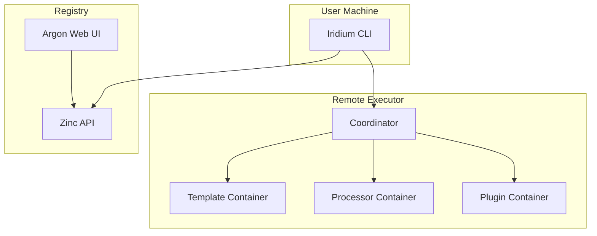
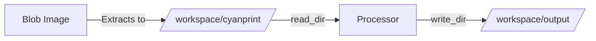

# Architecture Overview

CyanPrint uses a containerized architecture where each artifact runs in its own isolated environment.

## System Components



### Component Overview

| Component    | Description                              |
| ------------ | ---------------------------------------- |
| Iridium CLI  | User interface for running templates     |
| Zinc API     | Registry for discovering artifacts       |
| Argon Web UI | Web interface for browsing templates     |
| Coordinator  | Orchestrates artifact execution          |
| Containers   | Isolated environments for each artifact  |

## Execution Flow

```mermaid
sequenceDiagram
    participant User
    participant CLI
    participant Registry
    participant Coordinator
    participant Template:5550
    participant Processor:5551

    User->>CLI: cyanprint create atomi/template
    CLI->>Registry: GET /templates/atomi/template
    Registry-->>CLI: Image references
    CLI->>Coordinator: Start execution
    Coordinator->>Template: POST /api/template/init
    Template-->>Coordinator: Cyan config
    Coordinator->>Processor: POST /api/process
    Processor-->>Coordinator: Processed files
    Coordinator-->>CLI: Project files
```

### Step-by-Step

1. **Discovery** - CLI queries the registry for template metadata
2. **Initialization** - Coordinator starts the template container
3. **Collection** - Template collects user input and returns a Cyan config
4. **Processing** - Processor transforms files using the config
5. **Delivery** - Coordinator returns processed files to the CLI

## Container Communication

| Container  | Role                                     | Endpoints                                       |
| ---------- | ---------------------------------------- | ----------------------------------------------- |
| Template   | Collects user input, returns Cyan config | POST /api/template/init, /api/template/validate |
| Processor  | Reads files, transforms, writes output   | POST /api/process                               |
| Plugin     | Post-processing on generated files       | POST /api/plug                                  |

## Container Path Mechanics



### Critical Paths

| Path                   | Owner       | Warning                                         |
| ---------------------- | ----------- | ----------------------------------------------- |
| `/workspace`           | Coordinator | **WILL BE OVERRIDDEN** - never store files here |
| `/workspace/cyanprint` | Blob        | Extraction target; becomes processor's read_dir |
| `/workspace/output`    | Coordinator | Final output before delivery to CLI             |

## SDK Port Assignments

| Artifact  | Port | Endpoints                                       |
| --------- | ---- | ----------------------------------------------- |
| Template  | 5550 | POST /api/template/init, /api/template/validate |
| Processor | 5551 | POST /api/process                               |
| Plugin    | 5552 | POST /api/plug                                  |

Each artifact SDK starts an HTTP server on its assigned port. The Coordinator communicates with containers via these endpoints.
