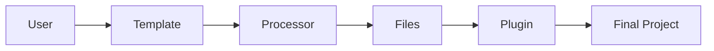

# Introduction to CyanPrint Development

CyanPrint is a template-based project generator with three extensible components called **artifacts**.

## The Three Artifacts

| Artifact       | Purpose                                         | SDK Port |
| -------------- | ----------------------------------------------- | -------- |
| **Templates**  | Define questions and file processing rules      | 5550     |
| **Processors** | Transform files (templating, syntax conversion) | 5551     |
| **Plugins**    | Post-processing (run commands, file operations) | 5552     |

### Templates

Templates are the primary artifact that users interact with. They:

- Define the questions to ask users
- Specify which processors to use for file transformations
- Configure plugins for post-processing

### Processors

Processors handle file transformation. They:

- Read files from the template
- Apply transformations (e.g., Mustache templating, syntax conversion)
- Write processed files to the output directory

### Plugins

Plugins run after files are generated. They:

- Execute shell commands
- Modify file permissions
- Initialize git repositories
- Install dependencies

## How They Work Together

1. **Template** collects user input and generates a Cyan config
2. **Processor** transforms template files using the config
3. **Plugin** applies final touches to the generated project

## Choose Your Path

- [Create a Template](/developer/templates) - Build project scaffolds
- [Create a Processor](/developer/processors) - Build file transformers
- [Create a Plugin](/developer/plugins) - Build post-processors
