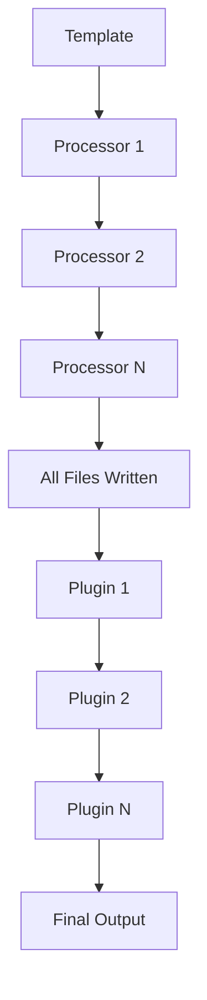
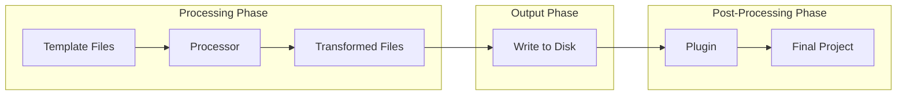

import { Callout } from 'fumadocs-ui/components/callout';

# Plugins vs Processors

Both plugins and processors extend CyanPrint's capabilities, but they serve different purposes in the generation pipeline.

## Quick Comparison

| Aspect | Processor | Plugin |
|--------|-----------|--------|
| **Role** | Transform file content | Execute operations |
| **When** | During file generation | After generation completes |
| **Access** | File content via helper | Full directory + shell |
| **State** | Pure function | Can have side effects |
| **API** | `CyanFileHelper` | Direct fs access |

## Processors: File Transformation

Processors transform file content. They operate on individual files during the generation process.

### What Processors Do

- Template variable substitution
- Syntax transformation
- Code generation
- File content processing

### Processor Example

```ts
import { StartProcessorWithLambda } from '@atomicloud/cyan-sdk';

StartProcessorWithLambda(async (input, fileHelper) => {
  const files = fileHelper.resolveAll();

  files.forEach(file => {
    // Transform file content
    file.content = file.content.replaceAll('var__name__', 'MyProject');
    file.writeFile();
  });

  return { directory: input.writeDirectory };
});
```

### Key Points

- Receives `CyanFileHelper` for file operations
- Transforms content before files are written
- Must be pure (same input → same output)
- Cannot execute shell commands

## Plugins: Post-Processing Operations

Plugins run operations after all files are generated. They have full access to the filesystem and can execute commands.

### What Plugins Do

- Run shell commands (git, npm, etc.)
- Install dependencies
- Initialize version control
- Set up development tooling

### Plugin Example

```ts
import { StartPluginWithLambda } from '@atomicloud/cyan-sdk';
import { $ } from 'bun';

StartPluginWithLambda(async (input) => {
  const { directory } = input;

  // Execute shell commands
  await $`git -C ${directory} init`.quiet();
  await $`cd ${directory} && npm install`.quiet();

  return { directory };
});
```

### Key Points

- No file helper - direct filesystem access
- Runs after all processors complete
- Can execute any shell command
- Can have side effects (installing packages, etc.)

## Execution Order



1. Template collects user input
2. Processors run in sequence (transform content)
3. All files are written to disk
4. Plugins run in sequence (post-processing)
5. Final output delivered to user

## When to Use Which

### Use a Processor When:

| Scenario | Example |
|----------|---------|
| Substitute variables | `var__name__` → `MyProject` |
| Transform file syntax | Convert Eta to final output |
| Generate code | Create files from templates |
| Process file content | Add headers, format code |
| Filter files | Include/exclude based on config |

### Use a Plugin When:

| Scenario | Example |
|----------|---------|
| Run git commands | `git init`, `git commit` |
| Install dependencies | `npm install`, `bun install` |
| Run formatters | `prettier --write .` |
| Set up tooling | `husky install` |
| Build steps | `npm run build` |
| Create symlinks | Link config files |

## Using Both Together

Many templates need both processors and plugins:

```ts
// In template's index.ts
return {
  processors: [{
    name: 'cyan/default',  // Transform templates
    files: [{ root: 'templates', glob: '**/*', type: GlobType.Template }],
    config: { vars: { name, version } }
  }],
  plugins: [{
    name: 'atomi/setup-plugin',  // Post-processing
    config: {
      git: true,
      installDeps: true
    }
  }]
};
```

### Typical Workflow

1. **Processor** substitutes `var__name__` with actual project name
2. **Processor** transforms template files
3. Files are written to output directory
4. **Plugin** initializes git repository
5. **Plugin** installs dependencies
6. User receives complete, ready-to-use project

<Callout type="info">
Use processors for content transformation and plugins for operations. Together they provide a complete generation pipeline.
</Callout>

## Architecture View



## Related

- [Processor Documentation](/developer/processors) - Full processor reference
- [Execution Order](/developer/plugins/explanation/execution-order) - Detailed pipeline sequence
- [What Are Plugins](/developer/plugins/explanation/what-are-plugins) - Plugin concepts
- [First Plugin](/developer/plugins/tutorials/first-plugin) - Create your first plugin
