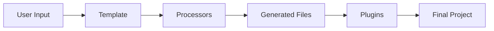
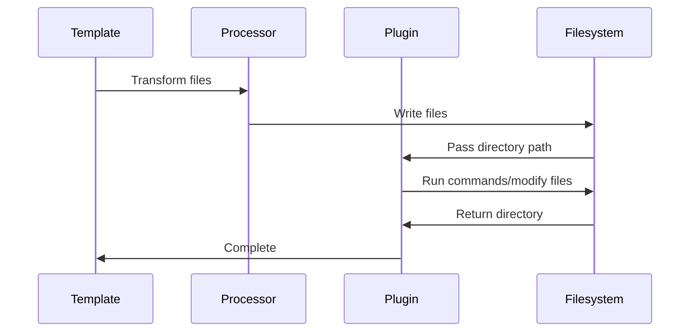

import { Callout } from 'fumadocs-ui/components/callout';

# What Are Plugins?

Plugins are post-processing components that run **after** all file generation is complete. They enable actions that processors cannot perform, such as running shell commands and executing system operations.

## The Big Picture



Plugins are the final step in the generation pipeline. After processors have transformed and written all files, plugins can:

- Run commands on the generated files
- Modify the filesystem
- Execute build steps
- Initialize version control

## What Plugins Can Do

| Capability | Example | Why It's a Plugin |
|------------|---------|-------------------|
| Initialize git | `git init` | Requires shell access |
| Install dependencies | `npm install` | Requires package manager |
| Run formatters | `prettier --write .` | Requires npm packages |
| Create symlinks | `ln -s` | Requires filesystem access |
| Build steps | `npm run build` | Requires toolchain |
| Set up hooks | `husky install` | Requires git + npm |

<Callout type="info">
Plugins are the only component with shell access. Processors are isolated and cannot execute commands.
</Callout>

## How Plugins Work

### Input

Plugins receive:
- `directory` - Path to all generated files
- `config` - Configuration from the template

### Execution



### Output

Plugins return:
- `directory` - Same path (for pipeline continuity)

## When to Use Plugins

### Use a Plugin When You Need To:

- Initialize a git repository
- Install npm/bun dependencies
- Run code formatters or linters
- Execute build commands
- Create symlinks or special files
- Set up development tooling

### Don't Use a Plugin When You Need To:

- Transform file content (use a processor)
- Substitute variables (use a processor)
- Process individual files (use a processor)

## Plugin vs Processor

| Aspect | Processor | Plugin |
|--------|-----------|--------|
| **Purpose** | Transform file content | Run operations |
| **Access** | File content only | Full filesystem + shell |
| **When** | During file generation | After all files written |
| **State** | Stateless | Can have side effects |
| **Example** | Replace `var__name__` | Run `git init` |

Read more in [Plugins vs Processors](/developer/plugins/explanation/plugins-vs-processors).

## Common Plugin Patterns

### Setup Plugin

Initialize the project environment:

```ts
StartPluginWithLambda(async (input) => {
  const { directory } = input;

  await $`git -C ${directory} init`.quiet();
  await $`cd ${directory} && npm install`.quiet();

  return { directory };
});
```

### Formatter Plugin

Run code formatters:

```ts
StartPluginWithLambda(async (input) => {
  const { directory, config } = input;
  const cfg = config as { formatter?: string };

  if (cfg.formatter === 'prettier') {
    await $`cd ${directory} && npx prettier --write .`.quiet();
  }

  return { directory };
});
```

### Build Plugin

Run build steps:

```ts
StartPluginWithLambda(async (input) => {
  const { directory, config } = input;
  const cfg = config as { build?: boolean };

  if (cfg.build) {
    await $`cd ${directory} && npm run build`.quiet();
  }

  return { directory };
});
```

## Design Philosophy

Plugins are designed to be:

1. **Simple** - Minimal API, just receive directory and return it
2. **Flexible** - Full filesystem and shell access
3. **Optional** - Templates work without plugins
4. **Composable** - Multiple plugins can be chained

## Related

- [Plugins vs Processors](/developer/plugins/explanation/plugins-vs-processors) - Detailed comparison
- [Execution Order](/developer/plugins/explanation/execution-order) - Pipeline sequence
- [First Plugin](/developer/plugins/tutorials/first-plugin) - Tutorial
