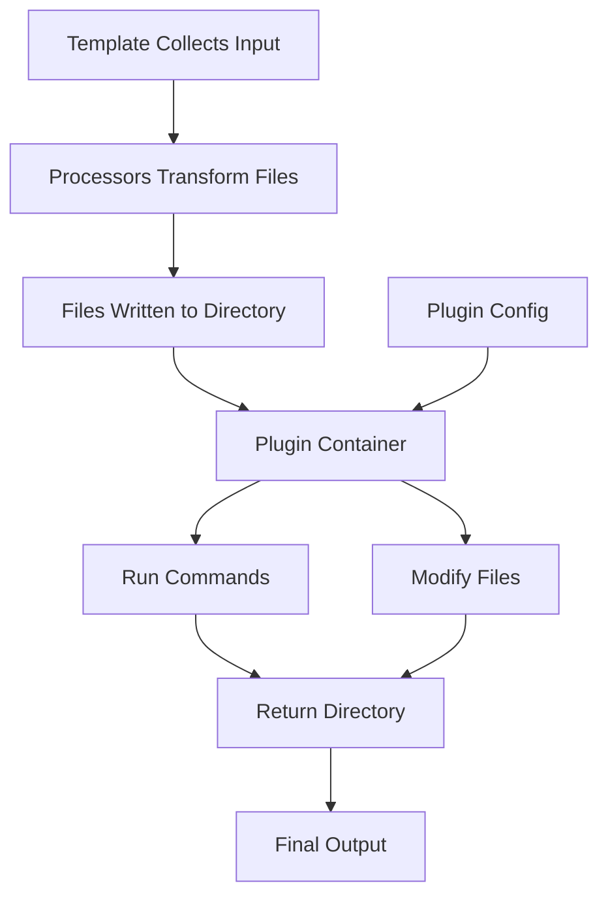

import { Callout } from 'fumadocs-ui/components/callout';

# Plugin Development

Plugins run **after** file generation, enabling post-processing like running commands or modifying files. While processors transform file content, plugins perform operations on the generated project.

## What is a Plugin?

A plugin is a Docker container that:

1. **Receives directory** containing all generated files
2. **Runs operations** on the directory (commands, file modifications)
3. **Returns directory** path for the next step

Plugins are the final step in the generation pipeline - they run after all processors have completed.

## Plugin Architecture



### Components

| Component | Purpose | Examples |
|-----------|---------|----------|
| **Entry Point** | Plugin logic | `StartPluginWithLambda` |
| **PluginInput** | Input from system | Directory, config |
| **PluginOutput** | Return value | Directory path |
| **Shell/Bun** | Command execution | `$` from bun, exec |

## What Plugins Can Do

Plugins have full access to the generated project directory:

| Capability | Example |
|------------|---------|
| Initialize git | `git init`, `git add .` |
| Install dependencies | `npm install`, `bun install` |
| Run formatters | `prettier --write .`, `biome format .` |
| Set up hooks | `husky install` |
| Create symlinks | Link config files |
| Build steps | `npm run build` |
| File modifications | Edit generated files |

<Callout type="info">
Plugins are the only component that can execute shell commands. Processors are stateless file transformers only.
</Callout>

## Learning Path

### Start Here: Tutorials

Build your first plugin step by step:

- [First Plugin](/developer/plugins/tutorials/first-plugin) - Create a plugin that runs post-processing commands

### How-To Guides

Task-oriented guides for common scenarios:

- [Run Shell Commands](/developer/plugins/how-to/run-commands) - Execute commands in the directory
- [Modify Generated Files](/developer/plugins/how-to/modify-files) - Read and edit files
- [Conditional Execution](/developer/plugins/how-to/conditional-execution) - Logic based on config
- [Push to Registry](/developer/plugins/how-to/push-to-registry) - Publish your plugin

[View all How-To Guides](/developer/plugins/how-to)

### Reference

Technical documentation for the SDK:

- [StartPluginWithLambda](/developer/plugins/reference/sdk/start-plugin) - Entry point
- [PluginInput/Output](/developer/plugins/reference/sdk/input-output) - Interfaces
- [Type Definitions](/developer/plugins/reference/sdk/types) - Full type reference
- [Plugin Dockerfile](/developer/plugins/reference/dockerfile) - Container setup

[View all Reference Docs](/developer/plugins/reference)

### Explanation

Deep dives into plugin concepts:

- [What Are Plugins](/developer/plugins/explanation/what-are-plugins) - Purpose and use cases
- [Plugins vs Processors](/developer/plugins/explanation/plugins-vs-processors) - When to use each
- [Execution Order](/developer/plugins/explanation/execution-order) - Pipeline sequence

[View all Explanations](/developer/plugins/explanation)

## Quick Example

Here's a minimal plugin that initializes git and installs dependencies:

```ts
import { StartPluginWithLambda } from '@atomicloud/cyan-sdk';
import { $ } from 'bun';

StartPluginWithLambda(async (input) => {
  const { directory, config } = input;
  const cfg = config as { installDeps?: boolean };

  // Initialize git repository
  await $`git -C ${directory} init`.quiet();

  // Optionally install dependencies
  if (cfg.installDeps) {
    await $`cd ${directory} && npm install`.quiet();
  }

  return { directory };
});
```

## Next Steps

- [Create your first plugin](/developer/plugins/tutorials/first-plugin)
- [Learn what plugins are](/developer/plugins/explanation/what-are-plugins)
- [Explore the Plugin API](/developer/plugins/reference/sdk/input-output)
