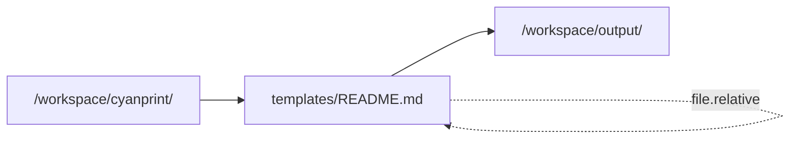

import { Callout } from 'fumadocs-ui/components/callout';

# Read and Write Directories

Processors work with two directories: `readDirectory` for input and `writeDirectory` for output. Understanding these is key to correct processor implementation.

## Directory Overview

```mermaid
graph LR
    subgraph Container
        A[/workspace/cyanprint/<br/>readDirectory]
        B[Processor]
        C[/workspace/output/<br/>writeDirectory]
    end

    A --> B
    B --> C

    style A fill:#f9f,stroke:#333
    style C fill:#9f9,stroke:#333
```

| Directory | Path | Purpose | Access |
|-----------|------|---------|--------|
| `readDirectory` | `/workspace/cyanprint/` | Source files | Read-only |
| `writeDirectory` | `/workspace/output/` | Generated files | Write-only |

## readDirectory

Contains files from the template's blob image. This is your **source material**.

### Typical Value

```
/workspace/cyanprint/
```

### Contents

Files from the template that match the processor's globs:

```
/workspace/cyanprint/
├── templates/
│   ├── README.md
│   ├── package.json
│   └── src/
│       └── index.ts
└── config/
    └── settings.json
```

### Accessing Files

Use `CyanFileHelper` - never access directly:

```ts
StartProcessorWithLambda(async (input, fileHelper) => {
  // ✅ Correct: Use fileHelper
  const files = fileHelper.resolveAll();

  // ❌ Wrong: Direct filesystem access
  // const content = fs.readFileSync(`${input.readDirectory}/README.md`);

  return { directory: input.writeDirectory };
});
```

<Callout type="warn">
Never access `readDirectory` directly with `fs` operations. Always use `CyanFileHelper` APIs.
</Callout>

## writeDirectory

Where processed files are written. This is your **output location**.

### Typical Value

```
/workspace/output/
```

### Writing Files

Use `writeFile()` on file objects:

```ts
StartProcessorWithLambda(async (input, fileHelper) => {
  const files = fileHelper.resolveAll();

  files.forEach(file => {
    // Transform content
    file.content = transform(file.content);

    // Write to writeDirectory
    file.writeFile();
  });

  return { directory: input.writeDirectory };
});
```

### VirtualFile Paths

The `relative` property is the path **between** read and write:

```ts
// Input: /workspace/cyanprint/templates/README.md
// file.relative = 'templates/README.md'
// Output: /workspace/output/templates/README.md
```



## Path Resolution

### How Paths Work

```ts
// Full input path
const inputPath = `${input.readDirectory}/${file.relative}`;
// Example: /workspace/cyanprint/templates/README.md

// Full output path
const outputPath = `${input.writeDirectory}/${file.relative}`;
// Example: /workspace/output/templates/README.md
```

### Modifying Output Paths

You can change where files are written:

```ts
StartProcessorWithLambda(async (input, fileHelper) => {
  const files = fileHelper.resolveAll();

  files.forEach(file => {
    // Transform content
    file.content = transform(file.content);

    // Optionally change output path
    if (file.relative.endsWith('.template')) {
      // Remove .template extension
      file.relative = file.relative.replace('.template', '');
    }

    file.writeFile();
  });

  return { directory: input.writeDirectory };
});
```

## Important Rules

### Rule 1: Always Return writeDirectory

```ts
// ✅ Correct
return { directory: input.writeDirectory };

// ❌ Wrong - never change this
// return { directory: '/some/other/path' };
```

### Rule 2: Use fileHelper for All File Operations

```ts
// ✅ Correct
const files = fileHelper.resolveAll();
files.forEach(f => f.writeFile());

// ❌ Wrong
// fs.readdirSync(input.readDirectory);
// fs.writeFileSync(`${input.writeDirectory}/file.txt`, content);
```

### Rule 3: Preserve Directory Structure (Usually)

```ts
// Usually you want to maintain the same structure
files.forEach(file => {
  // file.relative is preserved
  file.writeFile();
});

// Output mirrors input structure
```

### Rule 4: Handle Missing Writes

Files not written are not included in output:

```ts
files.forEach(file => {
  if (shouldInclude(file)) {
    file.writeFile(); // Included
  }
  // Files without writeFile() are excluded
});
```

## Example: Full Path Flow

```ts
StartProcessorWithLambda(async (input, fileHelper) => {
  console.log('Reading from:', input.readDirectory);
  // /workspace/cyanprint/

  console.log('Writing to:', input.writeDirectory);
  // /workspace/output/

  const files = fileHelper.resolveAll();

  files.forEach(file => {
    console.log('Processing:', file.relative);
    // templates/README.md

    // Full paths (conceptual - don't access directly)
    // Input:  /workspace/cyanprint/templates/README.md
    // Output: /workspace/output/templates/README.md

    file.content = transform(file.content);
    file.writeFile();
  });

  return { directory: input.writeDirectory };
});
```

## Related

- [CyanFileHelper API](/developer/processors/reference/sdk/file-helper) - File operations
- [Input/Output Types](/developer/processors/reference/sdk/input-output) - Type definitions
- [Stateless Nature](/developer/processors/explanation/stateless-nature) - Why isolation matters
