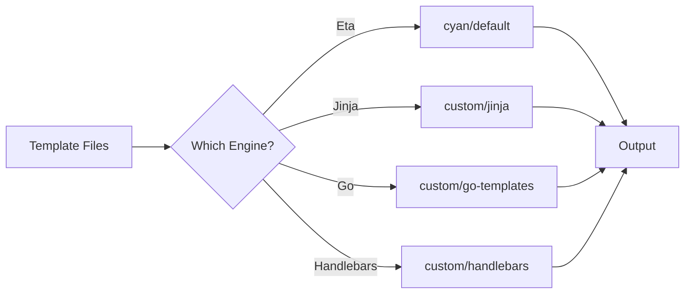
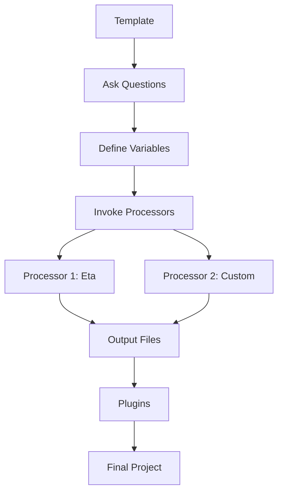

import { Callout } from 'fumadocs-ui/components/callout';

# Why Processors Exist

Processors exist because different projects need different file transformation strategies. The default processor covers common cases, but custom processors enable specialized needs.

## The Default Processor

CyanPrint includes a default processor (`cyan/default`) that uses Eta templating:

```markdown
# var__projectName__

Created by var__author__ on var__date__.
```

This works well for simple variable substitution. But what if you need more?

## When Default Isn't Enough

### Different Templating Engines

Your team might prefer different syntax:

| Engine | Syntax | Use Case |
|--------|--------|----------|
| **Eta** (default) | `var__name__` | General purpose |
| **Jinja** | `{{ name }}` | Python ecosystems |
| **Go Templates** | `{{ .Name }}` | Helm, Kubernetes |
| **Handlebars** | `{{name}}` | JavaScript projects |
| **Mustache** | `{{name}}` | Logic-less templates |



### Custom Logic

Some transformations go beyond simple variable substitution:

#### Code Generation

```ts
// GraphQL schema → TypeScript types
StartProcessorWithLambda(async (input, fileHelper) => {
  const schemas = fileHelper.read({ root: 'schemas', glob: '**/*.graphql' });

  for (const schema of schemas) {
    const types = generateTypeScript(schema.content);
    schema.relative = schema.relative.replace('.graphql', '.generated.ts');
    schema.content = types;
    schema.writeFile();
  }

  return { directory: input.writeDirectory };
});
```

#### AST Transformations

```ts
// Transform TypeScript using AST
StartProcessorWithLambda(async (input, fileHelper) => {
  const files = fileHelper.read({ root: 'src', glob: '**/*.ts' });

  for (const file of files) {
    const ast = parseTypeScript(file.content);
    addDeprecationComments(ast);
    file.content = printTypeScript(ast);
    file.writeFile();
  }

  return { directory: input.writeDirectory };
});
```

#### Conditional Processing

```ts
// Process based on config
StartProcessorWithLambda(async (input, fileHelper) => {
  const config = input.config as { env: 'dev' | 'prod' };
  const files = fileHelper.resolveAll();

  for (const file of files) {
    if (config.env === 'prod') {
      file.content = removeDebugCode(file.content);
    }
    file.writeFile();
  }

  return { directory: input.writeDirectory };
});
```

## Processing Pipelines

Processors can be chained for complex transformations:


### Example: Multi-Stage Pipeline

```ts
// In template configuration
return {
  processors: [
    // Stage 1: Preprocess
    {
      name: 'custom/preprocessor',
      files: [{ root: 'src', glob: '**/*', exclude: [], type: GlobType.Template }],
      config: { stripComments: true }
    },
    // Stage 2: Main templating
    {
      name: 'cyan/default',
      files: [{ root: 'src', glob: '**/*', exclude: [], type: GlobType.Template }],
      config: { vars: { name, version } }
    },
    // Stage 3: Postprocess
    {
      name: 'custom/formatter',
      files: [{ root: 'src', glob: '**/*', exclude: [], type: GlobType.Template }],
      config: { format: 'prettier' }
    }
  ]
};
```

## Separation of Concerns

Processors enable clean separation between:

| Concern | Handled By |
|---------|-----------|
| User questions | Template (`IInquirer`) |
| File transformation | Processor |
| Post-generation actions | Plugin |



## Extensibility

Processors make CyanPrint extensible:

1. **Core team** provides default processor
2. **Partners** create specialized processors
3. **Users** create custom processors for specific needs

<Callout type="info">
Processors are the primary extension point for file transformation in CyanPrint. If you need to change how files are processed, you need a processor.
</Callout>

## When to Use Custom Processors

### Use Custom Processor When:

- You need a different templating engine
- You're doing code generation
- You need AST-level transformations
- You have conditional processing logic
- You're transforming binary files
- You need multi-step processing

### Use Default Processor When:

- Simple variable substitution is enough
- You want to use Eta templating
- No special transformation logic needed

## Related

- [Stateless Nature](/developer/processors/explanation/stateless-nature) - Why processors are stateless
- [First Processor](/developer/processors/tutorials/first-processor) - Create your first processor
- [Processors vs Plugins](/developer/templates/explanation/processors-vs-plugins) - When to use each
