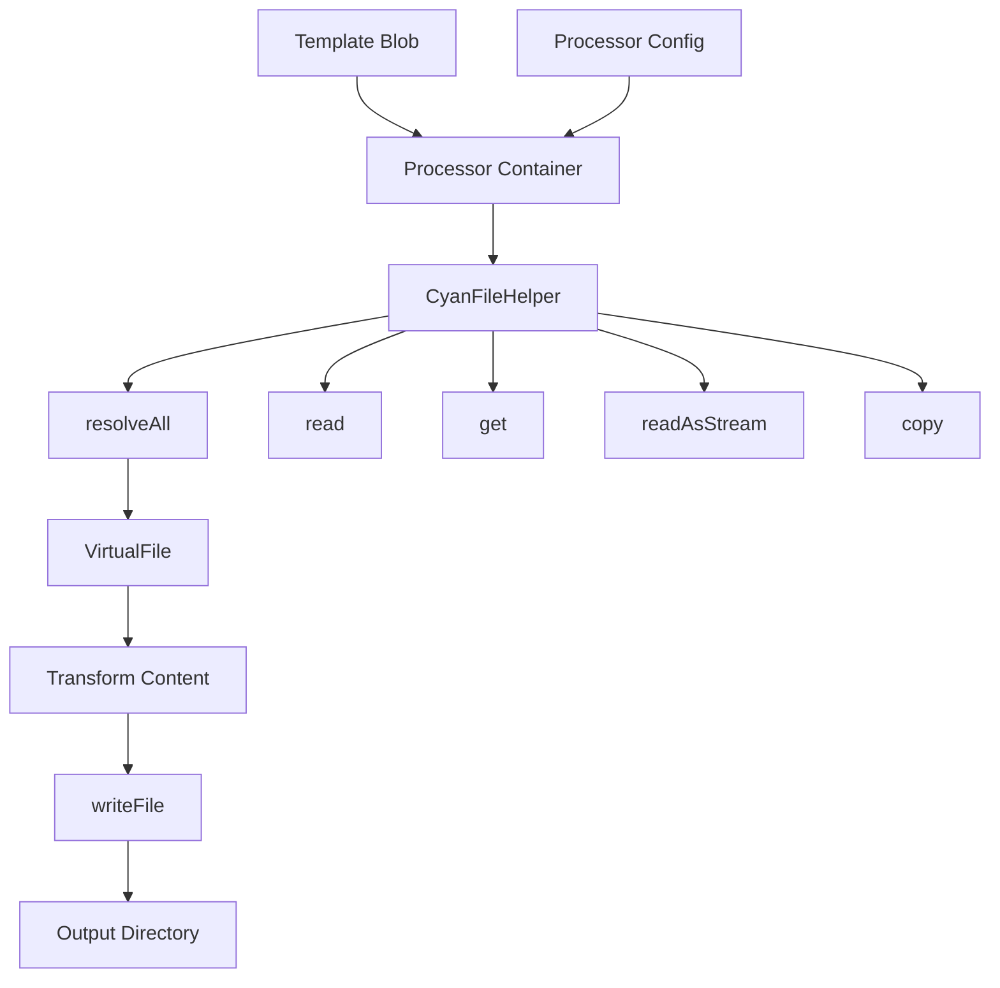

import { Callout } from 'fumadocs-ui/components/callout';

# Processor Development

Processors are the transformation engines that convert template files into generated output. The default processor uses Eta templating, but you can create custom processors for any transformation needs.

## What is a Processor?

A processor is a Docker container that:

1. **Receives files** from the template's blob image
2. **Transforms content** based on configuration
3. **Outputs files** to the write directory

Processors are stateless file transformers - they receive input files and produce output files without side effects.

## Processor Architecture



### Components

| Component | Purpose | Examples |
|-----------|---------|----------|
| **Entry Point** | Processor logic | `StartProcessorWithLambda` |
| **CyanFileHelper** | File operations | `resolveAll()`, `read()`, `copy()` |
| **ProcessorInput** | Input from template | Config, globs, directories |
| **ProcessorOutput** | Return value | Output directory path |

## Why Create a Custom Processor?

### Different Templating Engines

The default processor uses Eta with `var__name__` syntax. You might need:

| Engine | Use Case |
|--------|----------|
| Jinja | Python-style templates |
| Go templates | Helm/Kubernetes manifests |
| Mustache | Logic-less templates |
| Handlebars | Rich template features |

### Custom Logic

Processors enable custom processing that goes beyond simple variable substitution:

- Code generation (GraphQL, Protobuf, OpenAPI)
- AST transformations
- Binary file processing
- Multi-step pipelines

<Callout type="info">
Processors should be pure functions - same input always produces same output. This ensures reproducible project generation.
</Callout>

## Learning Path

### Start Here: Tutorials

Build your first processor step by step:

- [First Processor](/developer/processors/tutorials/first-processor) - Create a simple file transformer

### How-To Guides

Task-oriented guides for common scenarios:

- [Resolve All Files](/developer/processors/how-to/resolve-all-files) - Load all files into memory
- [Lazy Load Files](/developer/processors/how-to/lazy-load-files) - Get file references without content
- [Stream Large Files](/developer/processors/how-to/stream-large-files) - Memory-efficient streaming
- [Copy Files](/developer/processors/how-to/copy-files) - Copy without transformation
- [Access Config](/developer/processors/how-to/access-config) - Use processor configuration
- [Push to Registry](/developer/processors/how-to/push-to-registry) - Publish your processor

[View all How-To Guides](/developer/processors/how-to)

### Reference

Technical documentation for the SDK:

- [CyanFileHelper API](/developer/processors/reference/sdk/file-helper) - File operations
- [StartProcessorWithLambda](/developer/processors/reference/sdk/start-processor) - Entry point
- [Input/Output Types](/developer/processors/reference/sdk/input-output) - Interfaces
- [Type Definitions](/developer/processors/reference/sdk/types) - Full type reference

[View all Reference Docs](/developer/processors/reference)

### Explanation

Deep dives into processor concepts:

- [Why Processors Exist](/developer/processors/explanation/why-processors) - Purpose and use cases
- [Stateless Nature](/developer/processors/explanation/stateless-nature) - Reproducibility design
- [Read/Write Directories](/developer/processors/explanation/read-write-dirs) - Path mechanics
- [Memory Loading](/developer/processors/explanation/memory-loading) - Memory implications

[View all Explanations](/developer/processors/explanation)

## Quick Example

Here's a minimal processor that uppercases all file content:

```ts
import { StartProcessorWithLambda } from '@atomicloud/cyan-sdk';

StartProcessorWithLambda(async (input, fileHelper) => {
  const files = fileHelper.resolveAll();

  files.forEach(file => {
    file.content = file.content.toUpperCase();
    file.writeFile();
  });

  return { directory: input.writeDirectory };
});
```

## Next Steps

- [Create your first processor](/developer/processors/tutorials/first-processor)
- [Explore CyanFileHelper API](/developer/processors/reference/sdk/file-helper)
- [Learn why processors are stateless](/developer/processors/explanation/stateless-nature)
