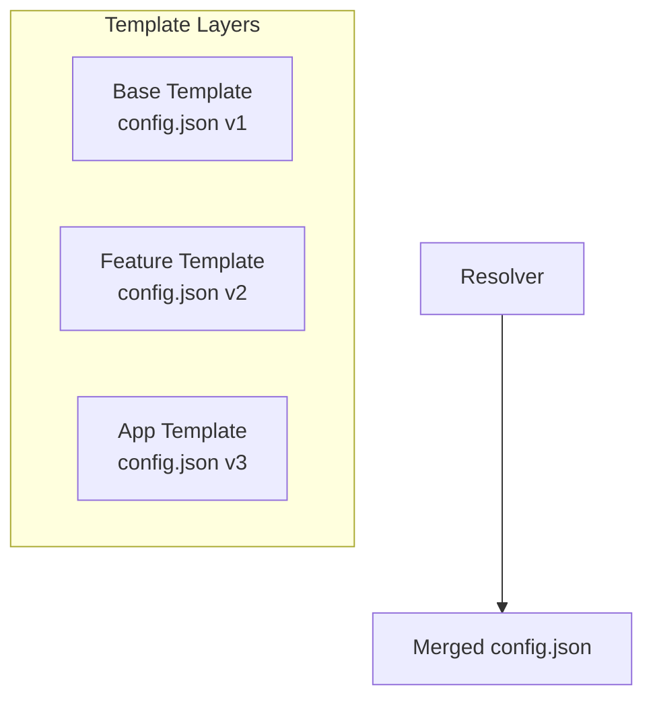
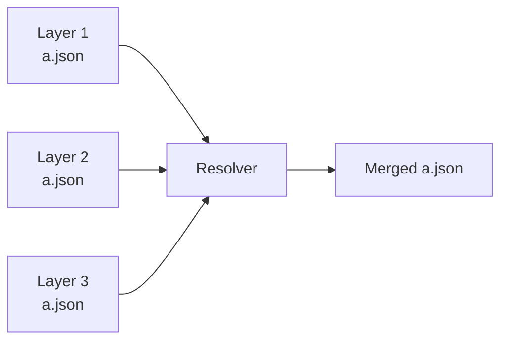
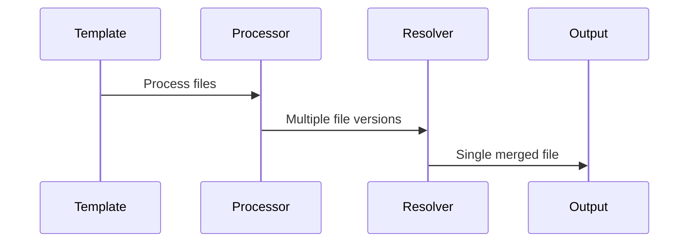

import { Callout } from 'fumadocs-ui/components/callout';
import { Mermaid } from '@/components/mdx/mermaid';
import { Cards, Card } from 'fumadocs-ui/components/card';

# What Are Resolvers?

Resolvers are components that handle file conflicts when composing multiple templates together. When templates are layered, the same file path may be provided by multiple sources.

## The Problem: File Conflicts
When you compose templates through:
- **Vertical layering** - Dependencies between templates
- **Horizontal layering** - Combining multiple templates

The same file may exist in multiple layers with potentially different content:



## How Resolvers Work

Resolvers receive:
1. **Multiple file versions** - All content from different template layers
2. **Layer information** - Which template and layer each version came from
3. **Configuration** - Merge strategy and other settings

And return a single merged file.

### Example: JSON File Conflict


Layer 1: `{"name": "app", "version": "1.0"}`
Layer 2: `{"name": "app", "version": "2.0", "features": ["auth"]}`
Layer 3: `{"name": "app", "features": ["auth", "logging"]}`

**Merged Result:**
```json
{
  "name": "app",
  "version": "2.0",
  "features": ["auth", "logging"]
}
```

<Callout type="info">
The key insight: Resolvers receive all versions and decide how to combine them. They don't care about which version came first—they receive everything and must produce a single output.
      </Callout>

## When to Use Resolvers
Use resolvers when you need to:
- **Combine configuration files** - Merge JSON, YAML, or other config formats
- **Merge dependency lists** - Combine package.json, requirements.txt
- **Aggregate content files** - Combine .gitignore, Dockerfile
- **Custom merge logic** - Implement domain-specific merge strategies

## Resolver vs Processor
Resolvers and processors have different purposes:

| Aspect | Processor | Resolver |
|--------|-----------|----------|
| **Purpose** | Transform individual files | Merge multiple file versions |
| **Input** | Single file | Multiple versions of same file |
| **Output** | Transformed file | Single merged file |
| **When Used** | During template processing | After processors complete |
| **Port** | 5551 | 5553 |

## Execution Flow


## Key Concepts

### Layer Priority
Files from lower-numbered layers take priority:
- Layer 0 = Base template
- Layer 1 = First extension
- Layer 2 = Second extension

### Determinism
Resolvers must be deterministic:
- Same inputs always produce the same output
- No randomness or external state dependencies
- Merge order must be consistent

### Configuration-Driven
Resolvers receive configuration from templates
- Merge strategy (concat, replace, distinct)
- Custom settings per file type

## Next Steps
<Cards>
  <Card href="/docs/developer/resolvers/explanation/resolvers-in-pipeline" title="Resolvers in Pipeline">
    How resolvers fit into the generation pipeline
  </Card>
  <Card href="/docs/developer/resolvers/tutorials/first-resolver" title="Build Your First Resolver">
    Step-by-step tutorial
  </Card>
</Cards>
