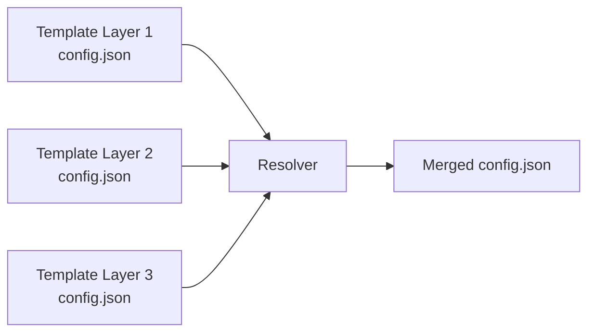

import { Steps } from 'fumadocs-ui/components/steps';
import { Callout } from 'fumadocs-ui/components/callout';
import { Tabs, Tab } from 'fumadocs-ui/components/tabs';
import { TypeTable } from 'fumadocs-ui/components/type-table';
import { Cards, Card } from 'fumadocs-ui/components/card';

# Your First Resolver

Create a resolver that merges JSON files from layered templates. This tutorial builds a JSON merger that combines multiple versions of the same file.

## Prerequisites

- Docker installed and running
- Basic knowledge of your chosen language (TypeScript, Python, or C#)

## How Resolvers Work

Resolvers receive multiple versions of the same file and must return a single merged output:



## Create Project

<Steps>

### Initialize Project

<Tabs items={['TypeScript', 'Python', 'C#']}>
  <Tab value="TypeScript">

```bash -c
mkdir my-resolver
cd my-resolver
bun init -y
bun add @atomicloud/cyan-sdk
```

  </Tab>
  <Tab value="Python">

```bash -c
mkdir my-resolver
cd my-resolver
# Create virtual environment
python -m venv .venv
source .venv/bin/activate  # On Windows: .venv\Scripts\activate
pip install cyanprintsdk
```

  </Tab>
  <Tab value="C#">

```bash -c
mkdir my-resolver
cd my-resolver
dotnet new console -n MyResolver
cd MyResolver
dotnet add package Sulfone.Helium
```

  </Tab>
</Tabs>

### Create Resolver Logic

Create the main resolver file:

<Tabs items={['TypeScript', 'Python', 'C#']}>
  <Tab value="TypeScript">

Create `index.ts`:

```ts index.ts -c
import { ResolverOutput, StartResolverWithLambda } from '@atomicloud/cyan-sdk';

StartResolverWithLambda(async (input): Promise<ResolverOutput> => {
  // Get all file versions (from different template layers)
  const files = input.files;

  // Validate: all files should have the same path
  const paths = files.map(f => f.path);
  const uniquePaths = new Set(paths);
  if (uniquePaths.size !== 1) {
    throw new Error(`Expected all files to have the same path, got: ${[...uniquePaths].join(', ')}`);
  }

  // Sort by layer (lower layer = higher priority)
  const sorted = [...files].sort(
    (a, b) => a.origin.layer - b.origin.layer
  );

  // Merge JSON content
  const merged = sorted.reduce((acc, file) => {
    const content = JSON.parse(file.content);
    return { ...acc, ...content };
  }, {});

  // Return merged output
  return {
    path: paths[0],
    content: JSON.stringify(merged, null, 2),
  };
});
```

  </Tab>
  <Tab value="Python">

Create `main.py`:

```py main.py -c
import json
from cyanprintsdk.domain.resolver.input import ResolverInput
from cyanprintsdk.domain.resolver.output import ResolverOutput
from cyanprintsdk.main import start_resolver_with_fn


async def resolver(i: ResolverInput) -> ResolverOutput:
    # Get all file versions (from different template layers)
    files = i.files

    # Validate: all files should have the same path
    paths = [f.path for f in files]
    unique_paths = set(paths)
    if len(unique_paths) != 1:
        raise ValueError(f"Expected all files to have the same path, got: {', '.join(unique_paths)}")

    # Sort by layer (lower layer = higher priority)
    sorted_files = sorted(files, key=lambda f: f.origin.layer)

    # Merge JSON content
    merged = {}
    for file in sorted_files:
        content = json.loads(file.content)
        merged = {**merged, **content}

    # Return merged output
    return ResolverOutput(
        path=paths[0],
        content=json.dumps(merged, indent=2)
    )


if __name__ == "__main__":
    start_resolver_with_fn(resolver)
```

  </Tab>
  <Tab value="C#">

Create `Program.cs`:

```cs Program.cs -c
using System.Text.Json;
using sulfone_helium;
using sulfone_helium.Domain.Resolver;

CyanEngine.StartResolver(
    args,
    async (ResolverInput input) =>
    {
        // Get all file versions (from different template layers)
        var files = input.Files.ToList();

        // Validate: all files should have the same path
        var paths = files.Select(f => f.Path).Distinct().ToList();
        if (paths.Count != 1)
        {
            throw new InvalidOperationException(
                $"Expected all files to have the same path, got: {string.Join(", ", paths)}");
        }

        // Sort by layer (lower layer = higher priority)
        var sorted = files.OrderBy(f => f.Origin.Layer).ToList();

        // Merge JSON content
        var merged = new Dictionary<string, object>();
        foreach (var file in sorted)
        {
            var content = JsonSerializer.Deserialize<Dictionary<string, object>>(file.Content)
                ?? new Dictionary<string, object>();
            foreach (var kvp in content)
            {
                merged[kvp.Key] = kvp.Value;
            }
        }

        // Return merged output
        return new ResolverOutput(
            paths[0],
            JsonSerializer.Serialize(merged, new JsonSerializerOptions { WriteIndented = true })
        );
    }
);
```

  </Tab>
</Tabs>

### Create Dockerfile

<Tabs items={['TypeScript', 'Python', 'C#']}>
  <Tab value="TypeScript">

Create `Dockerfile`:

```dockerfile Dockerfile -c
FROM oven/bun:1.1.30

WORKDIR /app

# Mark as CyanPrint resolver
LABEL cyanprint.dev=true

# Install dependencies
COPY package.json .
COPY bun.lock .
RUN bun install

# Copy resolver code
COPY . .

# Run resolver
CMD ["bun", "run", "index.ts"]
```

  </Tab>
  <Tab value="Python">

Create `Dockerfile`:

```dockerfile Dockerfile -c
FROM python:3.11-slim

WORKDIR /app

# Mark as CyanPrint resolver
LABEL cyanprint.dev=true

# Install dependencies
COPY requirements.txt .
RUN pip install --no-cache-dir -r requirements.txt

# Copy resolver code
COPY . .

# Run resolver
CMD ["python", "-u", "main.py"]
```

Create `requirements.txt`:

``` requirements.txt -c
cyanprintsdk>=1.0.0
```

  </Tab>
  <Tab value="C#">

Create `Dockerfile`:

```dockerfile Dockerfile -c
FROM mcr.microsoft.com/dotnet/aspnet:8.0 AS base
WORKDIR /app
ENV ASPNETCORE_URLS=http://+:5553

FROM mcr.microsoft.com/dotnet/sdk:8.0 AS build
WORKDIR /src
COPY ["MyResolver.csproj", "./"]
RUN dotnet restore "MyResolver.csproj"
COPY . .
RUN dotnet build "MyResolver.csproj" -c Release -o /app/build

FROM build AS publish
RUN dotnet publish "MyResolver.csproj" -c Release -o /app/publish /p:UseAppHost=false

FROM base AS final
LABEL cyanprint.dev=true
WORKDIR /app
COPY --from=publish /app/publish .

ENTRYPOINT ["dotnet", "MyResolver.dll"]
```

  </Tab>
</Tabs>

</Steps>

## Understanding the Code

### ResolverInput

The input contains configuration and all file versions:

<TypeTable
  type={{
    config: {
      type: 'Record<string, unknown>',
      description: 'Configuration from template',
    },
    files: {
      type: 'ResolvedFile[]',
      description: 'All versions of the conflicting file',
    },
  }}
/>

### ResolvedFile

Each file version includes its origin information:

<TypeTable
  type={{
    path: {
      type: 'string',
      description: 'File path (same for all versions)',
    },
    content: {
      type: 'string',
      description: 'File content',
    },
    origin: {
      type: 'FileOrigin',
      description: 'Template and layer information',
    },
  }}
/>

### FileOrigin

Identifies the source of each file version:

<TypeTable
  type={{
    template: {
      type: 'string',
      description: 'Template name that provided this file',
    },
    layer: {
      type: 'number',
      description: 'Layer number (lower = higher priority)',
    },
  }}
/>

### ResolverOutput

Return a single merged file:

<TypeTable
  type={{
    path: {
      type: 'string',
      description: 'Output file path',
    },
    content: {
      type: 'string',
      description: 'Merged file content',
    },
  }}
/>

## Build and Test

### Build Docker Image

<Tabs items={['TypeScript', 'Python', 'C#']}>
  <Tab value="TypeScript">

```bash -c
docker build -t my-resolver:dev .
```

  </Tab>
  <Tab value="Python">

```bash -c
docker build -t my-resolver:dev .
```

  </Tab>
  <Tab value="C#">

```bash -c
docker build -t my-resolver:dev .
```

  </Tab>
</Tabs>

### Use in Template

Configure your template's `cyan.yaml` to use the resolver:

```yaml cyan.yaml -c
resolvers:
  - resolver: my-org/my-resolver:1
    config:
      mergeStrategy: deep
    files:
      - config.json
      - package.json
```

<Callout type="info">
During development, use local Docker images with the `:dev` tag. Push to a registry when ready to share.
</Callout>

### Test Locally

Create a test template that uses your resolver, then run:

```bash -c
cyanprint try template ./test-template ./output
```

## What You Learned

- How to create a resolver project
- Understanding resolver input/output types
- Accessing file versions and their origins
- Merging content from multiple layers
- Returning a single merged file

## Next Steps

Learn more about resolver capabilities:

<Cards>
  <Card href="/docs/developer/resolvers/how-to/merge-json" title="Merge JSON Files">
    Deep merge strategies for JSON
  </Card>
  <Card href="/docs/developer/resolvers/how-to/merge-text" title="Merge Text Files">
    Handle text-based conflicts
  </Card>
  <Card href="/docs/developer/resolvers/reference/sdk/input-output" title="Resolver Input/Output">
    Full API reference
  </Card>
</Cards>
