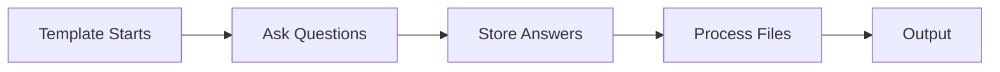

# Adding Interaction

Interactive templates ask users questions and customize output based on their answers. This tutorial shows you how to add meaningful user interactions.

**Time estimate**: 15-20 minutes

## What is Inquirer?

Inquirer is CyanPrint's interactive prompt system. It provides various question types to collect user input during template execution. The answers are stored and can be used throughout your template.

## Question Flow



## Basic Questions

Continue from the [Default Processor](./02-default-processor) tutorial. Let's enhance the interaction.

import { Tab, Tabs } from 'fumadocs-ui/components/tabs';

### Text Input

<Tabs groupId="sdk-language" items={['TypeScript', '.NET', 'Python']} persist>
  <Tab value="TypeScript">

```ts
// Simple text input
const name = await cyan.inquirer.text({
  message: 'Project name:'
});

// With default value
const name = await cyan.inquirer.text({
  message: 'Project name:',
  default: 'my-project'
});

// With validation
const name = await cyan.inquirer.text({
  message: 'Project name:',
  validate: (value) => {
    if (!value.match(/^[a-z0-9-]+$/)) {
      return 'Name must be lowercase alphanumeric with dashes';
    }
    return true;
  }
});
```

  </Tab>
  <Tab value=".NET">

```csharp
// Simple text input
var name = await cyan.Inquirer.TextAsync(new TextOptions
{
    Message = "Project name:"
});

// With default value
var name = await cyan.Inquirer.TextAsync(new TextOptions
{
    Message = "Project name:",
    Default = "my-project"
});

// With validation
var name = await cyan.Inquirer.TextAsync(new TextOptions
{
    Message = "Project name:",
    Validate = value =>
    {
        if (!Regex.IsMatch(value, @"^[a-z0-9-]+$"))
        {
            return "Name must be lowercase alphanumeric with dashes";
        }
        return null; // null means valid
    }
});
```

  </Tab>
  <Tab value="Python">

```python
# Simple text input
name = await cyan.inquirer.text(
    message="Project name:"
)

# With default value
name = await cyan.inquirer.text(
    message="Project name:",
    default="my-project"
)

# With validation
async def validate_name(value):
    if not re.match(r'^[a-z0-9-]+$', value):
        return "Name must be lowercase alphanumeric with dashes"
    return True

name = await cyan.inquirer.text(
    message="Project name:",
    validate=validate_name
)
```

  </Tab>
</Tabs>

### Single Selection

<Tabs groupId="sdk-language" items={['TypeScript', '.NET', 'Python']} persist>
  <Tab value="TypeScript">

```ts
const framework = await cyan.inquirer.select({
  message: 'Choose a framework:',
  options: [
    'React',
    'Vue',
    'Svelte',
    'Angular'
  ]
});

// With option objects
const framework = await cyan.inquirer.select({
  message: 'Choose a framework:',
  options: [
    { value: 'react', label: 'React', description: 'A JavaScript library' },
    { value: 'vue', label: 'Vue', description: 'The progressive framework' },
    { value: 'svelte', label: 'Svelte', description: 'Cybernetically enhanced' }
  ],
  default: 'react'
});
```

  </Tab>
  <Tab value=".NET">

```csharp
var framework = await cyan.Inquirer.SelectAsync(new SelectOptions
{
    Message = "Choose a framework:",
    Options = new[]
    {
        "React",
        "Vue",
        "Svelte",
        "Angular"
    }
});

// With option objects
var framework = await cyan.Inquirer.SelectAsync(new SelectOptions
{
    Message = "Choose a framework:",
    Options = new[]
    {
        new SelectOption { Value = "react", Label = "React", Description = "A JavaScript library" },
        new SelectOption { Value = "vue", Label = "Vue", Description = "The progressive framework" },
        new SelectOption { Value = "svelte", Label = "Svelte", Description = "Cybernetically enhanced" }
    },
    Default = "react"
});
```

  </Tab>
  <Tab value="Python">

```python
framework = await cyan.inquirer.select(
    message="Choose a framework:",
    options=[
        "React",
        "Vue",
        "Svelte",
        "Angular"
    ]
)

# With option objects
framework = await cyan.inquirer.select(
    message="Choose a framework:",
    options=[
        {"value": "react", "label": "React", "description": "A JavaScript library"},
        {"value": "vue", "label": "Vue", "description": "The progressive framework"},
        {"value": "svelte", "label": "Svelte", "description": "Cybernetically enhanced"}
    ],
    default="react"
)
```

  </Tab>
</Tabs>

### Multiple Selections

<Tabs groupId="sdk-language" items={['TypeScript', '.NET', 'Python']} persist>
  <Tab value="TypeScript">

```ts
const features = await cyan.inquirer.checkbox({
  message: 'Select features:',
  options: [
    { value: 'typescript', label: 'TypeScript', checked: true },
    { value: 'eslint', label: 'ESLint', checked: true },
    { value: 'prettier', label: 'Prettier' },
    { value: 'testing', label: 'Vitest' },
    { value: 'docker', label: 'Docker' }
  ]
});

// features is an array of selected values
// Example: ['typescript', 'eslint', 'prettier']
```

  </Tab>
  <Tab value=".NET">

```csharp
var features = await cyan.Inquirer.CheckboxAsync(new CheckboxOptions
{
    Message = "Select features:",
    Options = new[]
    {
        new CheckboxOption { Value = "typescript", Label = "TypeScript", Checked = true },
        new CheckboxOption { Value = "eslint", Label = "ESLint", Checked = true },
        new CheckboxOption { Value = "prettier", Label = "Prettier" },
        new CheckboxOption { Value = "testing", Label = "Vitest" },
        new CheckboxOption { Value = "docker", Label = "Docker" }
    }
});

// features is an array of selected values
// Example: ["typescript", "eslint", "prettier"]
```

  </Tab>
  <Tab value="Python">

```python
features = await cyan.inquirer.checkbox(
    message="Select features:",
    options=[
        {"value": "typescript", "label": "TypeScript", "checked": True},
        {"value": "eslint", "label": "ESLint", "checked": True},
        {"value": "prettier", "label": "Prettier"},
        {"value": "testing", "label": "Vitest"},
        {"value": "docker", "label": "Docker"}
    ]
)

# features is a list of selected values
# Example: ["typescript", "eslint", "prettier"]
```

  </Tab>
</Tabs>

### Confirmation

<Tabs groupId="sdk-language" items={['TypeScript', '.NET', 'Python']} persist>
  <Tab value="TypeScript">

```ts
const useGit = await cyan.inquirer.confirm({
  message: 'Initialize a git repository?',
  default: true
});

const installDeps = await cyan.inquirer.confirm({
  message: 'Install dependencies after generation?',
  default: false
});
```

  </Tab>
  <Tab value=".NET">

```csharp
var useGit = await cyan.Inquirer.ConfirmAsync(new ConfirmOptions
{
    Message = "Initialize a git repository?",
    Default = true
});

var installDeps = await cyan.Inquirer.ConfirmAsync(new ConfirmOptions
{
    Message = "Install dependencies after generation?",
    Default = false
});
```

  </Tab>
  <Tab value="Python">

```python
use_git = await cyan.inquirer.confirm(
    message="Initialize a git repository?",
    default=True
)

install_deps = await cyan.inquirer.confirm(
    message="Install dependencies after generation?",
    default=False
)
```

  </Tab>
</Tabs>

## Using Answers

### Accessing Answers

Answers are stored in `cyan.answers` and can be accessed anywhere in your template:

<Tabs groupId="sdk-language" items={['TypeScript', '.NET', 'Python']} persist>
  <Tab value="TypeScript">

```ts
// Access by property
const projectName = cyan.answers.projectName;

// Access checkbox results (array)
const features = cyan.answers.features as string[];

// Conditional logic
if (cyan.answers.useTypeScript) {
  // Add TypeScript-specific files
}

// Check if feature is selected
if (features.includes('testing')) {
  // Add testing configuration
}
```

  </Tab>
  <Tab value=".NET">

```csharp
// Access by key
var projectName = cyan.Answers["projectName"];

// Access checkbox results (array)
var features = (string[])cyan.Answers["features"];

// Conditional logic
if ((bool)cyan.Answers["useTypeScript"])
{
    // Add TypeScript-specific files
}

// Check if feature is selected
if (features.Contains("testing"))
{
    // Add testing configuration
}
```

  </Tab>
  <Tab value="Python">

```python
# Access by key
project_name = cyan.answers["projectName"]

# Access checkbox results (list)
features = cyan.answers["features"]

# Conditional logic
if cyan.answers["useTypeScript"]:
    # Add TypeScript-specific files
    pass

# Check if feature is selected
if "testing" in features:
    # Add testing configuration
    pass
```

  </Tab>
</Tabs>

### Conditional File Processing

<Tabs groupId="sdk-language" items={['TypeScript', '.NET', 'Python']} persist>
  <Tab value="TypeScript">

```ts
async execute(cyan: Cyan): Promise<void> {
  // Ask questions first
  const framework = await cyan.inquirer.select({
    message: 'Framework:',
    options: ['react', 'vue', 'svelte']
  });

  const features = await cyan.inquirer.checkbox({
    message: 'Features:',
    options: [
      { value: 'typescript', label: 'TypeScript' },
      { value: 'testing', label: 'Testing' },
      { value: 'eslint', label: 'ESLint' }
    ]
  });

  // Process files based on answers
  const baseFiles = cyan.glob('template/base/**/*');

  for (const file of baseFiles) {
    await cyan.processors.run('default-processor', {
      input: file,
      output: file.replace('template/base/', '')
    });
  }

  // Add framework-specific files
  const frameworkFiles = cyan.glob(`template/frameworks/${framework}/**/*`);

  for (const file of frameworkFiles) {
    await cyan.processors.run('default-processor', {
      input: file,
      output: file.replace(`template/frameworks/${framework}/`, '')
    });
  }

  // Conditionally add testing files
  if (features.includes('testing')) {
    const testFiles = cyan.glob('template/optional/testing/**/*');

    for (const file of testFiles) {
      await cyan.processors.run('default-processor', {
        input: file,
        output: file.replace('template/optional/testing/', '')
      });
    }
  }
}
```

  </Tab>
  <Tab value=".NET">

```csharp
public async Task ExecuteAsync(Cyan cyan)
{
    // Ask questions first
    var framework = await cyan.Inquirer.SelectAsync(new SelectOptions
    {
        Message = "Framework:",
        Options = new[] { "react", "vue", "svelte" }
    });

    var features = await cyan.Inquirer.CheckboxAsync(new CheckboxOptions
    {
        Message = "Features:",
        Options = new[]
        {
            new CheckboxOption { Value = "typescript", Label = "TypeScript" },
            new CheckboxOption { Value = "testing", Label = "Testing" },
            new CheckboxOption { Value = "eslint", Label = "ESLint" }
        }
    });

    // Process files based on answers
    var baseFiles = cyan.Glob("template/base/**/*");

    foreach (var file in baseFiles)
    {
        await cyan.Processors.RunAsync("default-processor", new ProcessorOptions
        {
            Input = file,
            Output = file.Replace("template/base/", "")
        });
    }

    // Add framework-specific files
    var frameworkFiles = cyan.Glob($"template/frameworks/{framework}/**/*");

    foreach (var file in frameworkFiles)
    {
        await cyan.Processors.RunAsync("default-processor", new ProcessorOptions
        {
            Input = file,
            Output = file.Replace($"template/frameworks/{framework}/", "")
        });
    }

    // Conditionally add testing files
    if (features.Contains("testing"))
    {
        var testFiles = cyan.Glob("template/optional/testing/**/*");

        foreach (var file in testFiles)
        {
            await cyan.Processors.RunAsync("default-processor", new ProcessorOptions
            {
                Input = file,
                Output = file.Replace("template/optional/testing/", "")
            });
        }
    }
}
```

  </Tab>
  <Tab value="Python">

```python
async def execute(self, cyan: Cyan):
    # Ask questions first
    framework = await cyan.inquirer.select(
        message="Framework:",
        options=["react", "vue", "svelte"]
    )

    features = await cyan.inquirer.checkbox(
        message="Features:",
        options=[
            {"value": "typescript", "label": "TypeScript"},
            {"value": "testing", "label": "Testing"},
            {"value": "eslint", "label": "ESLint"}
        ]
    )

    # Process files based on answers
    base_files = cyan.glob("template/base/**/*")

    for file in base_files:
        await cyan.processors.run("default-processor", {
            "input": file,
            "output": file.replace("template/base/", "")
        })

    # Add framework-specific files
    framework_files = cyan.glob(f"template/frameworks/{framework}/**/*")

    for file in framework_files:
        await cyan.processors.run("default-processor", {
            "input": file,
            "output": file.replace(f"template/frameworks/{framework}/", "")
        })

    # Conditionally add testing files
    if "testing" in features:
        test_files = cyan.glob("template/optional/testing/**/*")

        for file in test_files:
            await cyan.processors.run("default-processor", {
                "input": file,
                "output": file.replace("template/optional/testing/", "")
            })
```

  </Tab>
</Tabs>

## Complete Example

Here's a complete template that uses all question types:

<Tabs groupId="sdk-language" items={['TypeScript', '.NET', 'Python']} persist>
  <Tab value="TypeScript">

```ts
import { Cyan, ICyanTemplate } from '@atomicloud/helium-sdk';

export default class InteractiveTemplate implements ICyanTemplate {
  async execute(cyan: Cyan): Promise<void> {
    // Project basics
    const projectName = await cyan.inquirer.text({
      message: 'Project name:',
      default: 'my-project',
      validate: (value) =>
        value.match(/^[a-z0-9-]+$/) ? true : 'Invalid name format'
    });

    // Framework selection
    const framework = await cyan.inquirer.select({
      message: 'Select framework:',
      options: [
        { value: 'react', label: 'React' },
        { value: 'vue', label: 'Vue' },
        { value: 'svelte', label: 'Svelte' }
      ]
    });

    // Feature selection
    const features = await cyan.inquirer.checkbox({
      message: 'Select features:',
      options: [
        { value: 'typescript', label: 'TypeScript', checked: true },
        { value: 'eslint', label: 'ESLint' },
        { value: 'prettier', label: 'Prettier' },
        { value: 'testing', label: 'Testing' }
      ]
    });

    // Confirmations
    const useGit = await cyan.inquirer.confirm({
      message: 'Initialize git?',
      default: true
    });

    // Now process files using cyan.answers
    const files = cyan.glob('template/**/*');

    for (const file of files) {
      // Skip files based on conditions
      const isTypeScriptOnly = file.includes('typescript-only');

      if (isTypeScriptOnly && !features.includes('typescript')) {
        continue;
      }

      await cyan.processors.run('default-processor', {
        input: file,
        output: file.replace('template/', '')
      });
    }

    // Post-generation actions
    if (useGit) {
      await cyan.postActions.git('init');
    }
  }
}
```

  </Tab>
  <Tab value=".NET">

```csharp
using AtomiCloud.Helium;

public class InteractiveTemplate : ICyanTemplate
{
    public async Task ExecuteAsync(Cyan cyan)
    {
        // Project basics
        var projectName = await cyan.Inquirer.TextAsync(new TextOptions
        {
            Message = "Project name:",
            Default = "my-project",
            Validate = value =>
                Regex.IsMatch(value, @"^[a-z0-9-]+$") ? null : "Invalid name format"
        });

        // Framework selection
        var framework = await cyan.Inquirer.SelectAsync(new SelectOptions
        {
            Message = "Select framework:",
            Options = new[]
            {
                new SelectOption { Value = "react", Label = "React" },
                new SelectOption { Value = "vue", Label = "Vue" },
                new SelectOption { Value = "svelte", Label = "Svelte" }
            }
        });

        // Feature selection
        var features = await cyan.Inquirer.CheckboxAsync(new CheckboxOptions
        {
            Message = "Select features:",
            Options = new[]
            {
                new CheckboxOption { Value = "typescript", Label = "TypeScript", Checked = true },
                new CheckboxOption { Value = "eslint", Label = "ESLint" },
                new CheckboxOption { Value = "prettier", Label = "Prettier" },
                new CheckboxOption { Value = "testing", Label = "Testing" }
            }
        });

        // Confirmations
        var useGit = await cyan.Inquirer.ConfirmAsync(new ConfirmOptions
        {
            Message = "Initialize git?",
            Default = true
        });

        // Now process files using cyan.Answers
        var files = cyan.Glob("template/**/*");

        foreach (var file in files)
        {
            // Skip files based on conditions
            var isTypeScriptOnly = file.Contains("typescript-only");

            if (isTypeScriptOnly && !features.Contains("typescript"))
            {
                continue;
            }

            await cyan.Processors.RunAsync("default-processor", new ProcessorOptions
            {
                Input = file,
                Output = file.Replace("template/", "")
            });
        }

        // Post-generation actions
        if (useGit)
        {
            await cyan.PostActions.GitAsync("init");
        }
    }
}
```

  </Tab>
  <Tab value="Python">

```python
from helium_sdk import Cyan, ICyanTemplate
import re

class InteractiveTemplate(ICyanTemplate):
    async def execute(self, cyan: Cyan):
        # Project basics
        async def validate_name(value):
            return True if re.match(r'^[a-z0-9-]+$', value) else "Invalid name format"

        project_name = await cyan.inquirer.text(
            message="Project name:",
            default="my-project",
            validate=validate_name
        )

        # Framework selection
        framework = await cyan.inquirer.select(
            message="Select framework:",
            options=[
                {"value": "react", "label": "React"},
                {"value": "vue", "label": "Vue"},
                {"value": "svelte", "label": "Svelte"}
            ]
        )

        # Feature selection
        features = await cyan.inquirer.checkbox(
            message="Select features:",
            options=[
                {"value": "typescript", "label": "TypeScript", "checked": True},
                {"value": "eslint", "label": "ESLint"},
                {"value": "prettier", "label": "Prettier"},
                {"value": "testing", "label": "Testing"}
            ]
        )

        # Confirmations
        use_git = await cyan.inquirer.confirm(
            message="Initialize git?",
            default=True
        )

        # Now process files using cyan.answers
        files = cyan.glob("template/**/*")

        for file in files:
            # Skip files based on conditions
            is_typescript_only = "typescript-only" in file

            if is_typescript_only and "typescript" not in features:
                continue

            await cyan.processors.run("default-processor", {
                "input": file,
                "output": file.replace("template/", "")
            })

        # Post-generation actions
        if use_git:
            await cyan.post_actions.git("init")
```

  </Tab>
</Tabs>

## Summary

You've learned to add interactive prompts to templates:

- **Text input** for free-form values with validation
- **Select** for single-choice selection
- **Checkbox** for multiple selections
- **Confirm** for yes/no questions
- **Answers** are accessible throughout the template

## Next Steps

- [Inquirer Methods](./04-inquirer-methods) - Complete API reference
- [Shared Answers](./06-shared-answers) - Share answers between templates
- [Testing](./09-testing) - Test interactive templates
