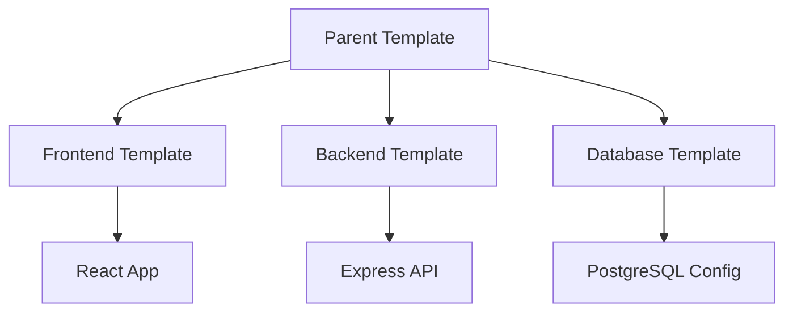
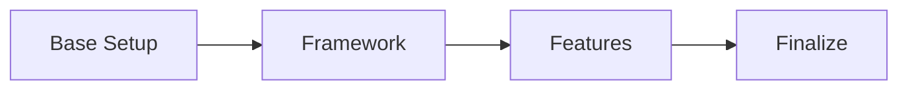
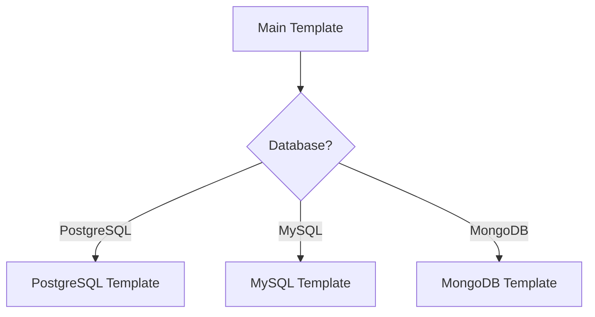

# Multiple Templates

Complex projects often require multiple templates working together. This guide shows you how to compose templates for sophisticated scaffolding scenarios.

## Why Compose Templates?

- **Modularity** - Reuse templates across projects
- **Separation of concerns** - Keep templates focused
- **Maintainability** - Update components independently
- **Flexibility** - Mix and match as needed

## Composition Patterns

### 1. Parent-Child Pattern

A parent template orchestrates multiple child templates:

import { Tab, Tabs } from 'fumadocs-ui/components/tabs';



### 2. Sequential Pattern

Templates execute in a defined order:



### 3. Conditional Pattern

Templates execute based on user choices:



## Configuring Child Templates

In `cyanprint.json`:

```json
{
  "name": "fullstack-app",
  "version": "1.0.0",
  "description": "Full-stack application template",
  "children": [
    {
      "name": "frontend",
      "template": "@company/react-template",
      "version": "^2.0.0",
      "path": "frontend"
    },
    {
      "name": "backend",
      "template": "@company/node-api",
      "version": "^1.5.0",
      "path": "backend"
    },
    {
      "name": "database",
      "template": "@company/database-template",
      "path": "database"
    }
  ]
}
```

### Configuration Options

| Option | Description | Required |
| ------ | ----------- | -------- |
| `name` | Identifier for the child | Yes |
| `template` | Template package name | Yes |
| `version` | Version constraint | No |
| `path` | Output subdirectory | No |
| `condition` | Conditional execution | No |
| `config` | Pass configuration | No |

## Executing Child Templates

<Tabs groupId="sdk-language" items={['TypeScript', '.NET', 'Python']} persist>
  <Tab value="TypeScript">

```ts
import { Cyan, ICyanTemplate } from '@atomicloud/helium-sdk';

export default class FullstackTemplate implements ICyanTemplate {
  async execute(cyan: Cyan): Promise<void> {
    // Collect shared configuration
    const projectName = await cyan.inquirer.text({
      message: 'Project name:'
    });

    const stack = await cyan.inquirer.checkbox({
      message: 'Select stack components:',
      options: [
        { value: 'frontend', label: 'Frontend (React)', checked: true },
        { value: 'backend', label: 'Backend (Node.js)', checked: true },
        { value: 'database', label: 'Database', checked: true }
      ]
    });

    // Set shared answers
    cyan.answers.projectName = projectName;

    // Execute children conditionally
    if (stack.includes('frontend')) {
      await cyan.children.run('frontend', {
        path: 'frontend'
      });
    }

    if (stack.includes('backend')) {
      await cyan.children.run('backend', {
        path: 'backend'
      });
    }

    if (stack.includes('database')) {
      const dbType = await cyan.inquirer.select({
        message: 'Database type:',
        options: ['PostgreSQL', 'MySQL', 'MongoDB']
      });

      await cyan.children.run('database', {
        path: 'database',
        config: { dbType }
      });
    }

    // Create root files (package.json, README, etc.)
    await this.createRootFiles(cyan);
  }

  private async createRootFiles(cyan: Cyan): Promise<void> {
    await cyan.processors.run('default-processor', {
      input: 'templates/root/**/*',
      output: '.'
    });
  }
}
```

  </Tab>
  <Tab value=".NET">

```csharp
using AtomiCloud.Helium;

public class FullstackTemplate : ICyanTemplate
{
    public async Task ExecuteAsync(Cyan cyan)
    {
        // Collect shared configuration
        var projectName = await cyan.Inquirer.TextAsync(new TextOptions
        {
            Message = "Project name:"
        });

        var stack = await cyan.Inquirer.CheckboxAsync(new CheckboxOptions
        {
            Message = "Select stack components:",
            Options = new[]
            {
                new CheckboxOption { Value = "frontend", Label = "Frontend (React)", Checked = true },
                new CheckboxOption { Value = "backend", Label = "Backend (Node.js)", Checked = true },
                new CheckboxOption { Value = "database", Label = "Database", Checked = true }
            }
        });

        // Set shared answers
        cyan.Answers["projectName"] = projectName;

        // Execute children conditionally
        if (stack.Contains("frontend"))
        {
            await cyan.Children.RunAsync("frontend", new ChildOptions
            {
                Path = "frontend"
            });
        }

        if (stack.Contains("backend"))
        {
            await cyan.Children.RunAsync("backend", new ChildOptions
            {
                Path = "backend"
            });
        }

        if (stack.Contains("database"))
        {
            var dbType = await cyan.Inquirer.SelectAsync(new SelectOptions
            {
                Message = "Database type:",
                Options = new[] { "PostgreSQL", "MySQL", "MongoDB" }
            });

            await cyan.Children.RunAsync("database", new ChildOptions
            {
                Path = "database",
                Config = new { dbType }
            });
        }

        // Create root files
        await CreateRootFilesAsync(cyan);
    }

    private async Task CreateRootFilesAsync(Cyan cyan)
    {
        await cyan.Processors.RunAsync("default-processor", new ProcessorOptions
        {
            Input = "templates/root/**/*",
            Output = "."
        });
    }
}
```

  </Tab>
  <Tab value="Python">

```python
from helium_sdk import Cyan, ICyanTemplate

class FullstackTemplate(ICyanTemplate):
    async def execute(self, cyan: Cyan):
        # Collect shared configuration
        project_name = await cyan.inquirer.text(
            message="Project name:"
        )

        stack = await cyan.inquirer.checkbox(
            message="Select stack components:",
            options=[
                {"value": "frontend", "label": "Frontend (React)", "checked": True},
                {"value": "backend", "label": "Backend (Node.js)", "checked": True},
                {"value": "database", "label": "Database", "checked": True}
            ]
        )

        # Set shared answers
        cyan.answers["projectName"] = project_name

        # Execute children conditionally
        if "frontend" in stack:
            await cyan.children.run("frontend", {
                "path": "frontend"
            })

        if "backend" in stack:
            await cyan.children.run("backend", {
                "path": "backend"
            })

        if "database" in stack:
            db_type = await cyan.inquirer.select(
                message="Database type:",
                options=["PostgreSQL", "MySQL", "MongoDB"]
            )

            await cyan.children.run("database", {
                "path": "database",
                "config": {"dbType": db_type}
            })

        # Create root files
        await self._create_root_files(cyan)

    async def _create_root_files(self, cyan: Cyan):
        await cyan.processors.run("default-processor", {
            "input": "templates/root/**/*",
            "output": "."
        })
```

  </Tab>
</Tabs>

## Passing Configuration to Children

### Method 1: Via Answers

<Tabs groupId="sdk-language" items={['TypeScript', '.NET', 'Python']} persist>
  <Tab value="TypeScript">

```ts
// Parent sets answers
cyan.answers.projectName = 'my-project';
cyan.answers.framework = 'react';

// Child reads answers
const projectName = cyan.answers.projectName;
```

  </Tab>
  <Tab value=".NET">

```csharp
// Parent sets answers
cyan.Answers["projectName"] = "my-project";
cyan.Answers["framework"] = "react";

// Child reads answers
var projectName = cyan.Answers["projectName"];
```

  </Tab>
  <Tab value="Python">

```python
# Parent sets answers
cyan.answers["projectName"] = "my-project"
cyan.answers["framework"] = "react"

# Child reads answers
project_name = cyan.answers["projectName"]
```

  </Tab>
</Tabs>

### Method 2: Via Config Parameter

<Tabs groupId="sdk-language" items={['TypeScript', '.NET', 'Python']} persist>
  <Tab value="TypeScript">

```ts
// Parent passes config
await cyan.children.run('database', {
  config: {
    dbType: 'postgresql',
    migrations: true
  }
});

// Child receives via cyan.config
const dbType = cyan.config.dbType;
```

  </Tab>
  <Tab value=".NET">

```csharp
// Parent passes config
await cyan.Children.RunAsync("database", new ChildOptions
{
    Config = new
    {
        dbType = "postgresql",
        migrations = true
    }
});

// Child receives via cyan.Config
var dbType = cyan.Config["dbType"];
```

  </Tab>
  <Tab value="Python">

```python
# Parent passes config
await cyan.children.run("database", {
    "config": {
        "dbType": "postgresql",
        "migrations": True
    }
})

# Child receives via cyan.config
db_type = cyan.config["dbType"]
```

  </Tab>
</Tabs>

## Orchestrating Execution Order

### Sequential Execution

<Tabs groupId="sdk-language" items={['TypeScript', '.NET', 'Python']} persist>
  <Tab value="TypeScript">

```ts
// Execute in order
await cyan.children.run('setup');
await cyan.children.run('framework');
await cyan.children.run('features');
await cyan.children.run('finalize');
```

  </Tab>
  <Tab value=".NET">

```csharp
// Execute in order
await cyan.Children.RunAsync("setup");
await cyan.Children.RunAsync("framework");
await cyan.Children.RunAsync("features");
await cyan.Children.RunAsync("finalize");
```

  </Tab>
  <Tab value="Python">

```python
# Execute in order
await cyan.children.run("setup")
await cyan.children.run("framework")
await cyan.children.run("features")
await cyan.children.run("finalize")
```

  </Tab>
</Tabs>

### Parallel Execution

<Tabs groupId="sdk-language" items={['TypeScript', '.NET', 'Python']} persist>
  <Tab value="TypeScript">

```ts
// Execute children in parallel
await Promise.all([
  cyan.children.run('frontend'),
  cyan.children.run('backend')
]);
```

  </Tab>
  <Tab value=".NET">

```csharp
// Execute children in parallel
await Task.WhenAll(
    cyan.Children.RunAsync("frontend"),
    cyan.Children.RunAsync("backend")
);
```

  </Tab>
  <Tab value="Python">

```python
import asyncio

# Execute children in parallel
await asyncio.gather(
    cyan.children.run("frontend"),
    cyan.children.run("backend")
)
```

  </Tab>
</Tabs>

## Output Directory Management

Each child writes to its specified path:

```
my-project/
├── frontend/          # cyan.children.run('frontend', { path: 'frontend' })
│   ├── src/
│   └── package.json
├── backend/           # cyan.children.run('backend', { path: 'backend' })
│   ├── src/
│   └── package.json
├── shared/            # cyan.children.run('shared', { path: 'shared' })
│   └── types/
├── package.json       # Parent template files
└── README.md
```

## Conditional Templates

Configure children to run conditionally:

```json
{
  "children": [
    {
      "name": "testing",
      "template": "@company/testing-template",
      "condition": "answers.features.includes('testing')"
    },
    {
      "name": "docker",
      "template": "@company/docker-template",
      "condition": "answers.deployment === 'docker'"
    }
  ]
}
```

## Complete Example

<Tabs groupId="sdk-language" items={['TypeScript', '.NET', 'Python']} persist>
  <Tab value="TypeScript">

```ts
import { Cyan, ICyanTemplate } from '@atomicloud/helium-sdk';

export default class MonorepoTemplate implements ICyanTemplate {
  async execute(cyan: Cyan): Promise<void> {
    // Phase 1: Collect all answers upfront
    await this.collectAnswers(cyan);

    // Phase 2: Setup base structure
    await cyan.processors.run('default-processor', {
      input: 'templates/base/**/*',
      output: '.'
    });

    // Phase 3: Execute apps
    await Promise.all([
      cyan.children.run('web', { path: 'apps/web' }),
      cyan.children.run('api', { path: 'apps/api' })
    ]);

    // Phase 4: Execute packages (conditional)
    if (cyan.answers.packages.includes('ui')) {
      await cyan.children.run('ui-lib', { path: 'packages/ui' });
    }

    if (cyan.answers.packages.includes('utils')) {
      await cyan.children.run('utils', { path: 'packages/utils' });
    }

    // Phase 5: Finalize
    await cyan.processors.run('default-processor', {
      input: 'templates/finalize/**/*',
      output: '.'
    });
  }

  private async collectAnswers(cyan: Cyan): Promise<void> {
    cyan.answers.projectName = await cyan.inquirer.text({
      message: 'Project name:',
      default: 'my-monorepo'
    });

    cyan.answers.packages = await cyan.inquirer.checkbox({
      message: 'Select shared packages:',
      options: [
        { value: 'ui', label: 'UI Components', checked: true },
        { value: 'utils', label: 'Utilities', checked: true },
        { value: 'config', label: 'Shared Config' }
      ]
    });

    cyan.answers.packageManager = await cyan.inquirer.select({
      message: 'Package manager:',
      options: ['pnpm', 'npm', 'yarn']
    });
  }
}
```

  </Tab>
  <Tab value=".NET">

```csharp
using AtomiCloud.Helium;

public class MonorepoTemplate : ICyanTemplate
{
    public async Task ExecuteAsync(Cyan cyan)
    {
        // Phase 1: Collect all answers upfront
        await CollectAnswersAsync(cyan);

        // Phase 2: Setup base structure
        await cyan.Processors.RunAsync("default-processor", new ProcessorOptions
        {
            Input = "templates/base/**/*",
            Output = "."
        });

        // Phase 3: Execute apps in parallel
        await Task.WhenAll(
            cyan.Children.RunAsync("web", new ChildOptions { Path = "apps/web" }),
            cyan.Children.RunAsync("api", new ChildOptions { Path = "apps/api" })
        );

        // Phase 4: Execute packages (conditional)
        var packages = (string[])cyan.Answers["packages"];
        if (packages.Contains("ui"))
        {
            await cyan.Children.RunAsync("ui-lib", new ChildOptions { Path = "packages/ui" });
        }

        if (packages.Contains("utils"))
        {
            await cyan.Children.RunAsync("utils", new ChildOptions { Path = "packages/utils" });
        }

        // Phase 5: Finalize
        await cyan.Processors.RunAsync("default-processor", new ProcessorOptions
        {
            Input = "templates/finalize/**/*",
            Output = "."
        });
    }

    private async Task CollectAnswersAsync(Cyan cyan)
    {
        cyan.Answers["projectName"] = await cyan.Inquirer.TextAsync(new TextOptions
        {
            Message = "Project name:",
            Default = "my-monorepo"
        });

        cyan.Answers["packages"] = await cyan.Inquirer.CheckboxAsync(new CheckboxOptions
        {
            Message = "Select shared packages:",
            Options = new[]
            {
                new CheckboxOption { Value = "ui", Label = "UI Components", Checked = true },
                new CheckboxOption { Value = "utils", Label = "Utilities", Checked = true },
                new CheckboxOption { Value = "config", Label = "Shared Config" }
            }
        });

        cyan.Answers["packageManager"] = await cyan.Inquirer.SelectAsync(new SelectOptions
        {
            Message = "Package manager:",
            Options = new[] { "pnpm", "npm", "yarn" }
        });
    }
}
```

  </Tab>
  <Tab value="Python">

```python
from helium_sdk import Cyan, ICyanTemplate
import asyncio

class MonorepoTemplate(ICyanTemplate):
    async def execute(self, cyan: Cyan):
        # Phase 1: Collect all answers upfront
        await self._collect_answers(cyan)

        # Phase 2: Setup base structure
        await cyan.processors.run("default-processor", {
            "input": "templates/base/**/*",
            "output": "."
        })

        # Phase 3: Execute apps in parallel
        await asyncio.gather(
            cyan.children.run("web", {"path": "apps/web"}),
            cyan.children.run("api", {"path": "apps/api"})
        )

        # Phase 4: Execute packages (conditional)
        packages = cyan.answers["packages"]
        if "ui" in packages:
            await cyan.children.run("ui-lib", {"path": "packages/ui"})

        if "utils" in packages:
            await cyan.children.run("utils", {"path": "packages/utils"})

        # Phase 5: Finalize
        await cyan.processors.run("default-processor", {
            "input": "templates/finalize/**/*",
            "output": "."
        })

    async def _collect_answers(self, cyan: Cyan):
        cyan.answers["projectName"] = await cyan.inquirer.text(
            message="Project name:",
            default="my-monorepo"
        )

        cyan.answers["packages"] = await cyan.inquirer.checkbox(
            message="Select shared packages:",
            options=[
                {"value": "ui", "label": "UI Components", "checked": True},
                {"value": "utils", "label": "Utilities", "checked": True},
                {"value": "config", "label": "Shared Config"}
            ]
        )

        cyan.answers["packageManager"] = await cyan.inquirer.select(
            message="Package manager:",
            options=["pnpm", "npm", "yarn"]
        )
```

  </Tab>
</Tabs>

## See Also

- [Shared Answers](./06-shared-answers) - Sharing data between templates
- [Plugins in Templates](./08-plugins-in-templates) - Extending functionality
- [Best Practices](./13-best-practices) - Template design patterns
