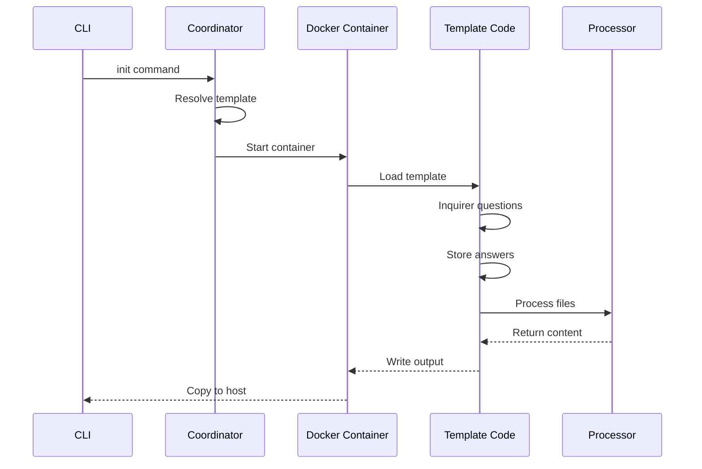
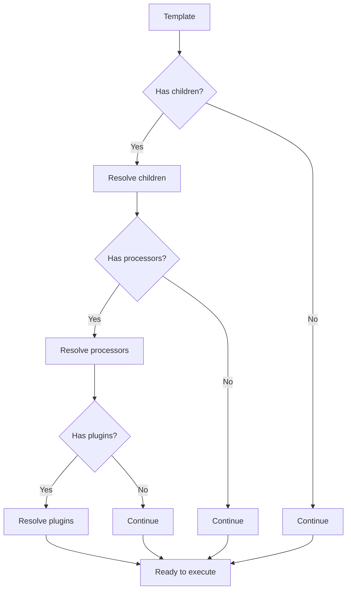
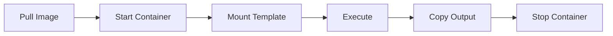
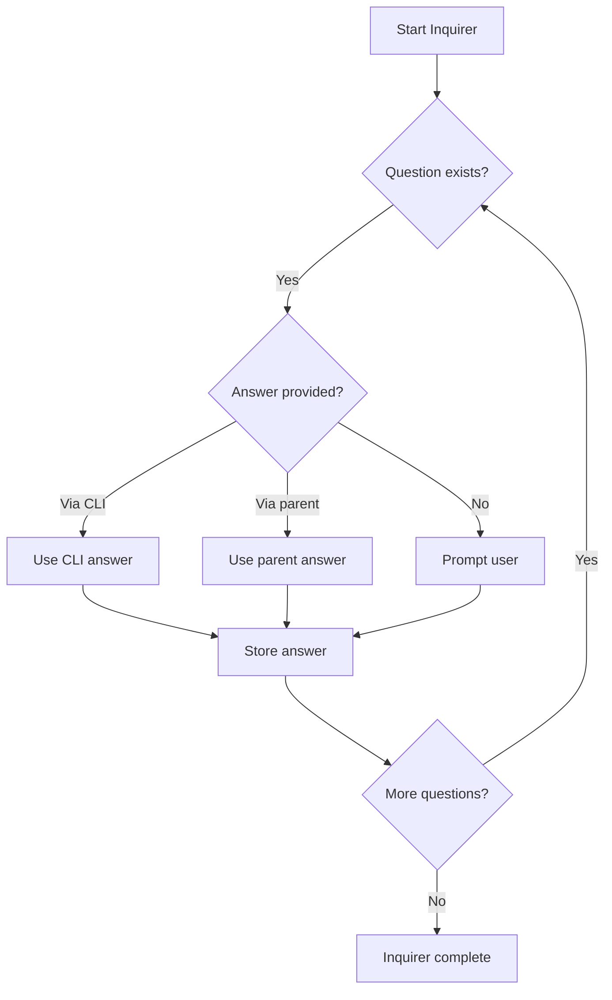
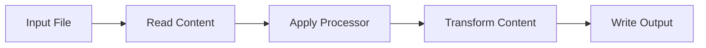
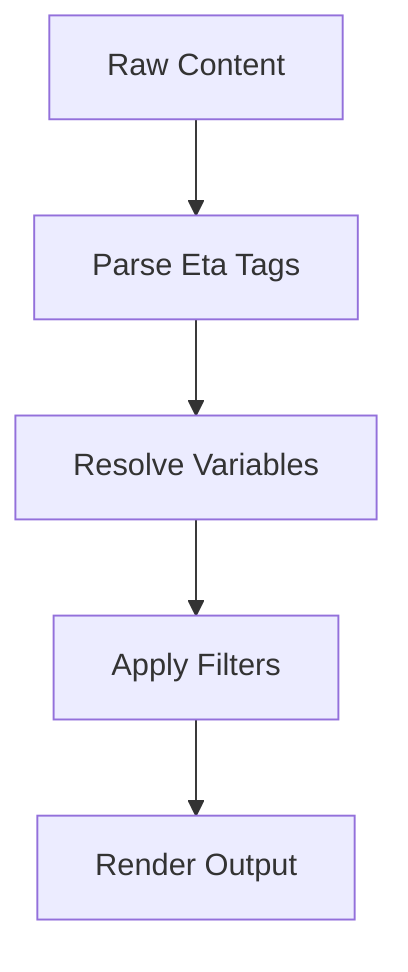
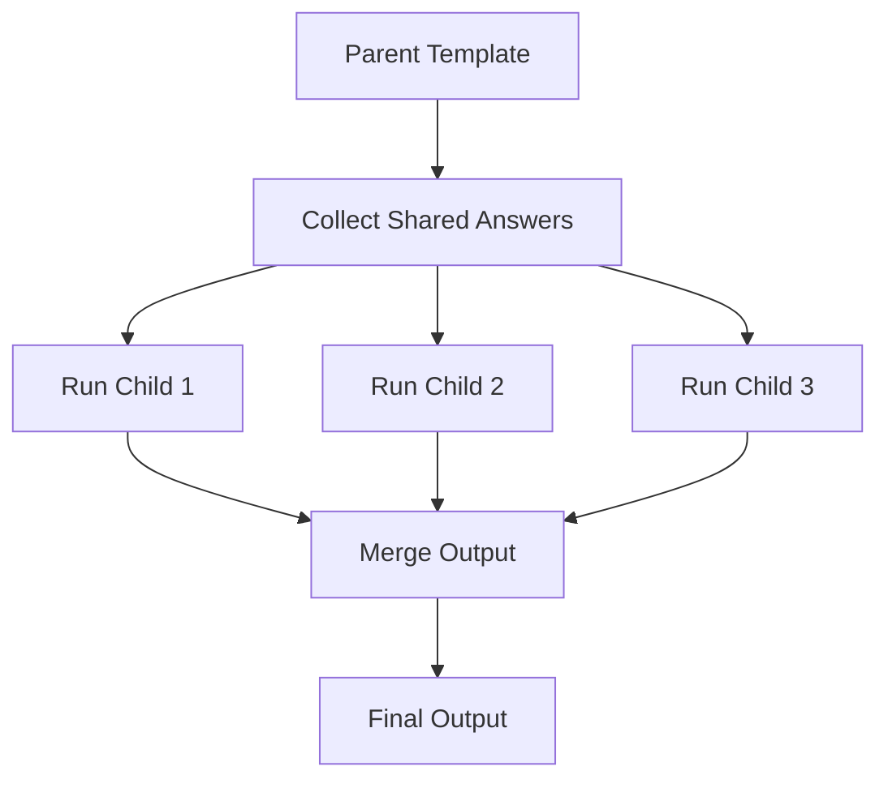
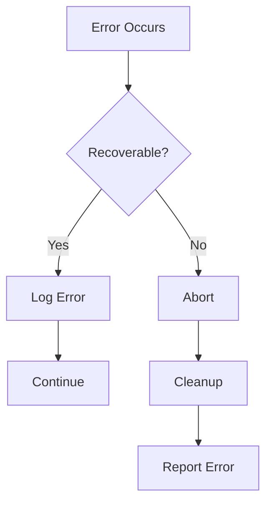

# Template Lifecycle

Understanding the template execution lifecycle helps you build more sophisticated templates and debug issues effectively.

## Overview

When a user runs `cyanprint init`, the following sequence occurs:



## Phase 1: Resolution

### Template Discovery

import { Tab, Tabs } from 'fumadocs-ui/components/tabs';

1. **Local template** - `--local ./path`
2. **Registry template** - `--template @org/template-name`
3. **Git template** - `--template github:org/repo`

### Dependency Resolution



## Phase 2: Container Setup

Templates execute in isolated Docker containers for:
- **Reproducibility** - Consistent execution environment
- **Security** - Sandboxed template code
- **Language support** - Container has required SDK runtime

### Container Lifecycle



## Phase 3: Template Execution

### Initialization

<Tabs groupId="sdk-language" items={['TypeScript', '.NET', 'Python']} persist>
  <Tab value="TypeScript">

```ts
// The template is instantiated and execute() is called
const template = new MyTemplate();
await template.execute(cyan);
```

  </Tab>
  <Tab value=".NET">

```csharp
// The template is instantiated and ExecuteAsync() is called
var template = new MyTemplate();
await template.ExecuteAsync(cyan);
```

  </Tab>
  <Tab value="Python">

```python
# The template is instantiated and execute() is called
template = MyTemplate()
await template.execute(cyan)
```

  </Tab>
</Tabs>

### Execution Context

The `Cyan` object is initialized with:

| Property | Source |
| -------- | ------ |
| `answers` | Merged from parent, CLI args, and inquirer |
| `config` | From cyanprint.json |
| `determinism` | Seeded from execution context |
| `files` | Scoped to template directory |
| `plugins` | Loaded and initialized |

## Phase 4: Inquirer Phase

### Question Flow



### Answer Merging Priority

1. **CLI arguments** (highest priority)
2. **Parent template answers**
3. **Shared answers from previous runs**
4. **Default values**
5. **User prompts** (lowest priority - only if no other source)

## Phase 5: File Processing

### Glob Resolution

<Tabs groupId="sdk-language" items={['TypeScript', '.NET', 'Python']} persist>
  <Tab value="TypeScript">

```ts
// Pattern is resolved relative to template directory
const files = cyan.glob('template/files/**/*');
// Returns: ['template/files/package.json', 'template/files/src/index.ts', ...]
```

  </Tab>
  <Tab value=".NET">

```csharp
// Pattern is resolved relative to template directory
var files = cyan.Glob("template/files/**/*");
// Returns: ["template/files/package.json", "template/files/src/index.ts", ...]
```

  </Tab>
  <Tab value="Python">

```python
# Pattern is resolved relative to template directory
files = cyan.glob("template/files/**/*")
# Returns: ["template/files/package.json", "template/files/src/index.ts", ...]
```

  </Tab>
</Tabs>

### Processor Execution



For each file:

1. **Read** file content from template
2. **Determine** which processor to use (based on file type or explicit)
3. **Execute** processor with content and answers
4. **Write** transformed content to output

### Default Processor Flow



## Phase 6: Output Generation

### File Writing

Files are written to the output directory:

```
output/
├── package.json    # Generated from template
├── src/
│   └── index.ts    # Generated from template
└── README.md       # Generated from template
```

### Post-Generation Actions

<Tabs groupId="sdk-language" items={['TypeScript', '.NET', 'Python']} persist>
  <Tab value="TypeScript">

```ts
// Git initialization (if using git plugin)
if (cyan.plugins.has('git-plugin')) {
  const git = cyan.plugins.get('git-plugin');
  await git.init({ branch: 'main' });
  await git.add('.');
  await git.commit('Initial commit from template');
}
```

  </Tab>
  <Tab value=".NET">

```csharp
// Git initialization (if using git plugin)
if (cyan.Plugins.Has("git-plugin"))
{
    var git = cyan.Plugins.Get("git-plugin");
    await git.InitAsync(new { branch = "main" });
    await git.AddAsync(".");
    await git.CommitAsync("Initial commit from template");
}
```

  </Tab>
  <Tab value="Python">

```python
# Git initialization (if using git plugin)
if cyan.plugins.has("git-plugin"):
    git = cyan.plugins.get("git-plugin")
    await git.init({"branch": "main"})
    await git.add(".")
    await git.commit("Initial commit from template")
```

  </Tab>
</Tabs>

## Phase 7: Child Templates

When templates have children:



### Child Execution Order

1. **Sequential** - Children run in definition order
2. **Parallel** - Children run concurrently (if configured)
3. **Conditional** - Children run based on conditions

## Phase 8: Cleanup

### Container Teardown

After template execution:

1. **Copy output** - Generated files copied to host
2. **Stop container** - Container stopped
3. **Remove container** - Container removed (unless debugging)
4. **Log results** - Execution summary logged

### Error Handling

If errors occur:



## Lifecycle Hooks

Plugins can hook into lifecycle events:

| Hook | When | Use Case |
| ---- | ---- | -------- |
| `beforeExecute` | Before template runs | Setup, validation |
| `afterInquirer` | After questions | Answer transformation |
| `beforeProcess` | Before file processing | Pre-processing |
| `afterProcess` | After file processing | Post-processing |
| `afterExecute` | After template completes | Cleanup, notifications |
| `onError` | On error | Error handling, cleanup |

## Timing Diagram

```
┌─────────────────────────────────────────────────────────────────┐
│ Timeline                                                        │
├─────────────────────────────────────────────────────────────────┤
│ [0-50ms]    Resolution - Find and load template                 │
│ [50-200ms]  Container Start - Pull image, initialize            │
│ [200-300ms] Initialization - Create Cyan object, load plugins   │
│ [300-?]     Inquirer - User interaction (variable)              │
│ [?-?+1s]    Processing - Transform files                        │
│ [?+1s-?+2s] Output - Write files, run post-actions              │
│ [?+2s-?+3s] Cleanup - Stop container, copy output               │
└─────────────────────────────────────────────────────────────────┘
```

## Debugging the Lifecycle

### Enable Debug Mode

```bash
# Run with debug output
cyanprint init my-project --template @org/template --debug

# Keep container for inspection
cyanprint init my-project --template @org/template --keep-container
```

### Inspect Container

```bash
# List running containers
docker ps

# Shell into container
docker exec -it <container-id> sh

# View logs
docker logs <container-id>
```

## See Also

- [Core Concepts](../01-concepts) - Understanding the SDK
- [Template API](./11-api-reference) - Full API reference
- [Testing](./09-testing) - Testing templates
- [Best Practices](./13-best-practices) - Template design patterns
