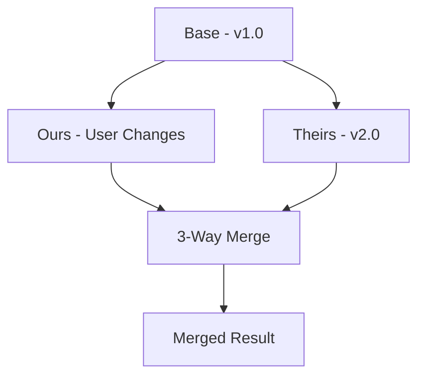
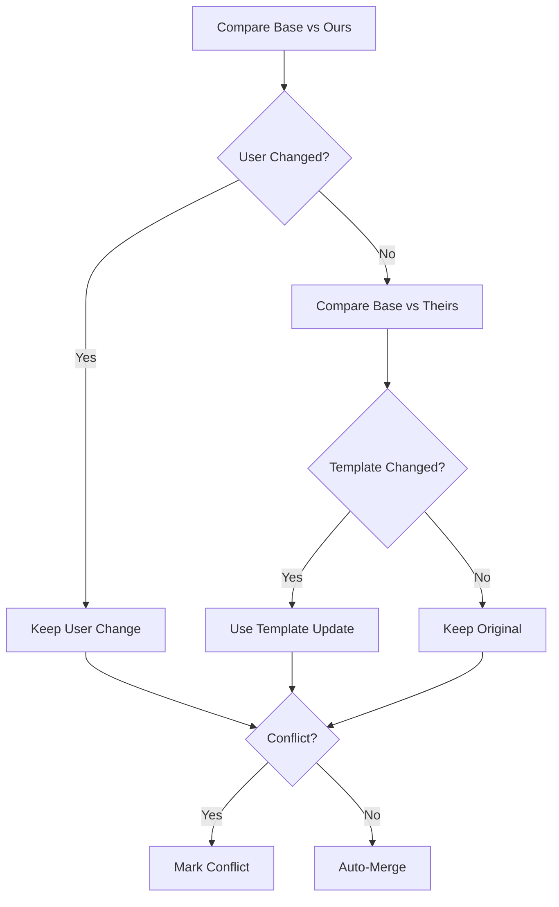

# 3-Way Merge

CyanPrint uses 3-way merge to update templates while preserving user modifications.

## What is 3-Way Merge?

3-way merge combines three versions of files:

1. **Base** - Original generated files
2. **Ours** - User modifications
3. **Theirs** - New template version



## Why 3-Way Merge?

When users modify generated projects, naive updates would:
- Lose user changes (overwrite)
- Miss template improvements (skip)

3-way merge:
- Preserves user modifications
- Incorporates template updates
- Flags conflicts for resolution

## How It Works

### Generation Tracking

Each generation stores its base state:

```
.cyan/
├── generation.json     # Metadata
└── base/               # Original generated files
    ├── README.md
    └── package.json
```

### Update Process

1. **Read base** - Load original generated files
2. **Read ours** - Load current project files
3. **Generate theirs** - Run new template version
4. **Merge** - Combine all three versions
5. **Report conflicts** - Flag unresolved changes

### Merge Algorithm



## Example Scenario

### Original Generation (v1.0)

Base `README.md`:

```markdown
# my-project

A sample project.
```

### User Modification

User changes `README.md`:

```markdown
# my-project

A sample project.

## Features

- Feature 1
- Feature 2
```

### Template Update (v2.0)

New template generates:

```markdown
# my-project

A sample project.

## Installation

npm install
```

### 3-Way Merge Result

```markdown
# my-project

A sample project.

## Installation

npm install

## Features

- Feature 1
- Feature 2
```

## Conflict Detection

When both user and template change the same content:

### User Change

```markdown
# My Awesome Project
```

### Template Change

```markdown
# my-project

[]
```

### Conflict

```
<<<<<<< OURS
# My Awesome Project
=======
# my-project

[]
>>>>>>> THEIRS
```

## Determinism and Updates

The pin system ensures IDs remain consistent across updates:

```ts
// v1.0 generation
const projectId = d.uuid(); // "abc-123"

// v2.0 update with same pin
const projectId = d.uuid(); // "abc-123" - same!
```

This allows:
- Database migrations to work
- API contracts to remain valid
- References to stay consistent

## Update Command

```bash
# Update to latest version
cyanprint update ./my-project

# Update to specific version
cyanprint update ./my-project myorg/template:2.0.0

# Preview changes without applying
cyanprint update ./my-project --dry-run
```

## Best Practices

### For Template Authors

1. **Minimize breaking changes** - Keep file structure stable
2. **Use semantic versioning** - Major versions for breaking changes
3. **Document changes** - Help users understand updates
4. **Test updates** - Verify merge behavior

### For Users

1. **Commit before updating** - Easy rollback if needed
2. **Review conflicts carefully** - Don't blindly accept changes
3. **Test after updates** - Verify everything still works
4. **Keep base files** - Don't delete `.cyan/`

## Limitations

3-way merge works best with:
- Text files (not binaries)
- Line-based changes
- Small modifications

It may struggle with:
- Large reorganizations
- Binary file changes
- Complex refactors

## Related

- [Determinism](/developer/templates/explanation/determinism) - How IDs stay consistent
- [Client State](/developer/templates/explanation/client-state) - State management
- [Pin Determinism](/developer/templates/how-to/pin-determinism) - Pin usage guide
