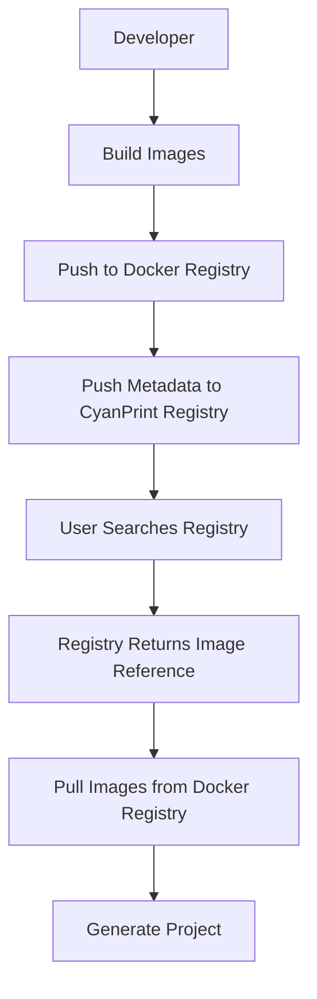

import { Callout } from 'fumadocs-ui/components/callout';

# Docker Registry vs CyanPrint Registry

CyanPrint uses two types of registries: Docker registries for images and CyanPrint registry for metadata.

## Overview

| Registry | Purpose | Examples |
|----------|---------|----------|
| Docker Registry | Store template and blob images | Docker Hub, GHCR, private |
| CyanPrint Registry | Store template metadata | CyanPrint Cloud, private |

## Docker Registry

Docker registries store the actual template images.

### What's Stored

1. **Template Image** - Contains template logic
2. **Blob Image** - Contains template files

### Common Options

#### Docker Hub

```bash
docker login
docker buildx build -t docker.io/myorg/my-template:1.0.0 --push .
```

- Free for public repos
- Paid for private repos
- Widely accessible

#### GitHub Container Registry (GHCR)

```bash
echo $GITHUB_TOKEN | docker login ghcr.io -u USERNAME --password-stdin
docker buildx build -t ghcr.io/myorg/my-template:1.0.0 --push .
```

- Free with GitHub account
- Integrated with GitHub Actions
- Good for open source

#### Private Registry

```bash
docker login registry.example.com
docker buildx build -t registry.example.com/myorg/my-template:1.0.0 --push .
```

- Full control
- Behind firewall option
- Self-hosted

## CyanPrint Registry

CyanPrint registry stores metadata about templates.

### What's Stored

1. **Template metadata** - Name, version, description
2. **Image references** - Links to Docker images
3. **Composition info** - Template dependencies
4. **Search index** - For template discovery

### Registration

```bash
cyanprint push template --token $CYAN_TOKEN \
  myorg/my-template-blob 1.0.0 \
  myorg/my-template 1.0.0
```

This registers:
- Template name and version
- Blob image reference
- Template image reference

### Benefits

- **Discovery** - Search for templates
- **Resolution** - Find template by name
- **Versioning** - Track template versions
- **Composition** - Resolve dependencies

## How They Work Together



## Workflow

### Publishing

1. Build images and push to Docker registry
2. Register with CyanPrint registry

```bash
# 1. Build and push to Docker Hub
docker buildx build --platform linux/amd64,linux/arm64 \
  -f cyan/template.Dockerfile \
  -t docker.io/myorg/my-template:1.0.0 \
  --push .

docker buildx build --platform linux/amd64,linux/arm64 \
  -f cyan/blob.Dockerfile \
  -t docker.io/myorg/my-template-blob:1.0.0 \
  --push .

# 2. Register with CyanPrint
cyanprint push template --token $CYAN_TOKEN \
  docker.io/myorg/my-template-blob 1.0.0 \
  docker.io/myorg/my-template 1.0.0
```

### Using

```bash
# User searches
cyanprint search nodejs

# User creates
cyanprint create myorg/node-template:1.0.0 ./my-project
```

## Registry Options

### CyanPrint Cloud

Official CyanPrint registry:

- `registry.cyanprint.io`
- Managed service
- Integrated with CLI

### Private CyanPrint Registry

Self-hosted option:

- Full control
- Behind firewall
- Custom authentication

<Callout type="info">
For internal templates, you can use only Docker registry with direct image references, bypassing CyanPrint registry.
</Callout>

## Direct Docker Usage

Use templates without CyanPrint registry:

```bash
# Direct image reference
cyanprint create docker.io/myorg/my-template:1.0.0 ./my-project

# With registry prefix
cyanprint create ghcr.io/myorg/my-template:1.0.0 ./my-project
```

This works but loses:
- Template discovery
- Version management
- Composition resolution

## Related

- [Push to Registry](/developer/templates/how-to/push-to-registry) - Publishing guide
- [Dockerfiles Reference](/developer/templates/reference/dockerfiles) - Docker configuration
- [Project Structure](/developer/templates/reference/project-structure) - Template organization
