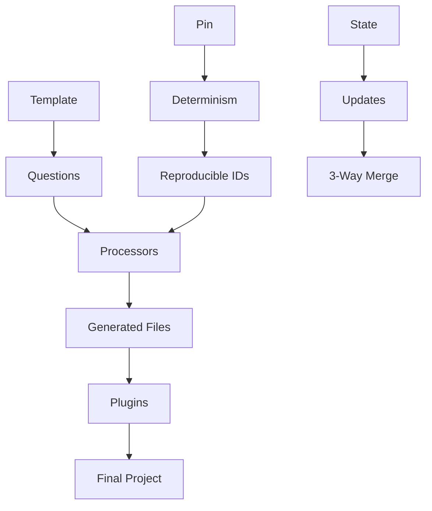

# Template Explanation

Understanding the concepts and architecture behind CyanPrint templates.

## Core Concepts

### Configuration

- [Cyan Configuration Object](/developer/templates/explanation/cyan-object) - Understanding the structure returned by templates
- [Default Processor](/developer/templates/explanation/default-processor) - How the cyan/default processor works with Eta templating

### Determinism

- [Determinism](/developer/templates/explanation/determinism) - How reproducible generation works
- [Client State](/developer/templates/explanation/client-state) - Managing state across executions
- [3-Way Merge](/developer/templates/explanation/3-way-merge) - How template updates preserve user changes

### Architecture

- [Container Paths](/developer/templates/explanation/container-paths) - Path mechanics in template containers
- [Processors vs Plugins](/developer/templates/explanation/processors-vs-plugins) - When to use each
- [Docker vs Cyan Registry](/developer/templates/explanation/docker-vs-cyan-registry) - Registry comparison

## Conceptual Overview

## Key Questions

### Why var__name__ syntax?

The `var__name__` syntax avoids conflicts with common template syntaxes like `${}` or `{{}}`. See [Default Processor](/developer/templates/explanation/default-processor).

### How do updates work?

3-way merge combines the original template, user changes, and new template version. See [3-Way Merge](/developer/templates/explanation/3-way-merge).

### How are IDs consistent?

The pin system seeds deterministic value generation. See [Determinism](/developer/templates/explanation/determinism).

### When to use processors vs plugins?

Processors transform files; plugins execute actions. See [Processors vs Plugins](/developer/templates/explanation/processors-vs-plugins).

## Next Steps

- [Tutorials](/developer/templates/tutorials) - Step-by-step learning
- [How-To Guides](/developer/templates/how-to) - Task-oriented guides
- [Reference](/developer/templates/reference) - Technical documentation
