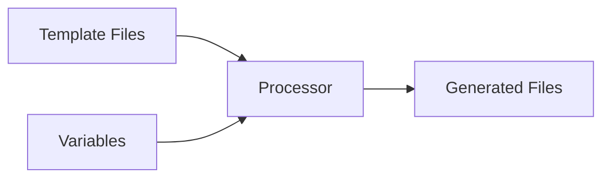
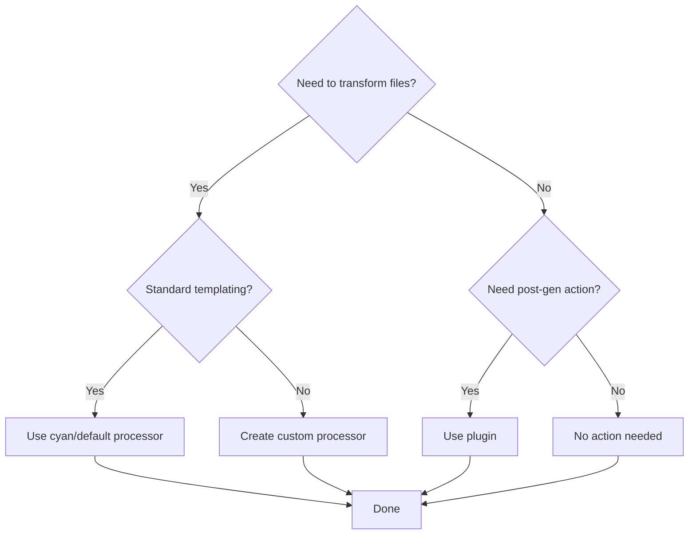

import { Callout } from 'fumadocs-ui/components/callout';

# Processors vs Plugins

Processors and plugins serve different purposes in CyanPrint. Understanding when to use each is key to effective template design.

## Quick Comparison

| Aspect | Processors | Plugins |
|--------|------------|---------|
| **When** | During file generation | After file generation |
| **What** | Transform file content | Execute actions |
| **Input** | Template files + variables | Generated project |
| **Output** | Transformed files | Side effects |
| **Examples** | Variable substitution, code gen | Git init, npm install |

## Processors

Processors handle **file transformation** during generation.

### When to Use

- Variable substitution in files
- Template engine processing (Eta, Handlebars)
- Code generation (GraphQL, Protobuf)
- File content transformation
- Custom file processing logic

### How They Work



### Example

```ts
return {
  processors: [{
    name: 'cyan/default',
    files: [
      { root: 'templates', glob: '**/*.md', exclude: [], type: GlobType.Template }
    ],
    config: {
      vars: { name: 'my-project' }
    }
  }]
};
```

Template file:

```markdown
# var__name__

Welcome to var__name__!
```

Generated file:

```markdown
# my-project

Welcome to my-project!
```

## Plugins

Plugins handle **post-generation actions** after files are created.

### When to Use

- Git repository initialization
- Dependency installation
- Running scripts
- External service integration
- IDE configuration
- File permissions

### How They Work


### Example

```ts
return {
  processors: [/* ... */],
  plugins: [
    {
      name: 'cyan/init-git',
      config: { commitMessage: 'Initial commit' }
    },
    {
      name: 'cyan/npm-install',
      config: { packageManager: 'pnpm' }
    }
  ]
};
```

## Decision Flow



## Common Patterns

### Template with Variable Substitution

Use **processor**:

```ts
processors: [{
  name: 'cyan/default',
  files: [{ root: 'templates', glob: '**/*', exclude: [], type: GlobType.Template }],
  config: { vars: { name, version } }
}]
```

### Code Generation

Use **custom processor**:

```ts
processors: [{
  name: 'myorg/graphql-codegen',
  files: [{ root: 'schemas', glob: '**/*.graphql', exclude: [], type: GlobType.Template }],
  config: { generateTypes: true, outputDir: 'src/generated' }
}]
```

### Git Initialization

Use **plugin**:

```ts
plugins: [{
  name: 'cyan/init-git',
  config: { commitMessage: 'Initial commit' }
}]
```

### Install Dependencies

Use **plugin**:

```ts
plugins: [{
  name: 'cyan/npm-install',
  config: { packageManager: 'pnpm' }
}]
```

## Creating Custom

### Custom Processor

Create when you need specialized file processing:

1. Define processor package
2. Implement `IProcessor` interface
3. Register with registry
4. Use in templates

See [Processor Development](/developer/processors) for details.

### Custom Plugin

Create when you need post-generation actions:

1. Define plugin package
2. Implement `IPlugin` interface
3. Register with registry
4. Use in templates

See [Plugin Development](/developer/plugins) for details.

## Best Practices

1. **Use default processor** for standard templating
2. **Create custom processors** for specialized file processing
3. **Use plugins** for actions that modify project state
4. **Keep processors focused** on file transformation
5. **Keep plugins focused** on side effects

<Callout type="info">
Processors should be pure functions of input files and variables. Plugins handle impure operations like filesystem changes and external services.
</Callout>

## Related

- [Default Processor](/developer/templates/explanation/default-processor) - How cyan/default works
- [Processor Development](/developer/processors) - Creating custom processors
- [Plugin Development](/developer/plugins) - Creating custom plugins
- [Use Custom Processor](/developer/templates/how-to/use-custom-processor) - How-to guide
