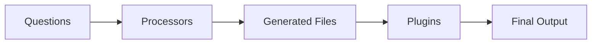

import { Callout } from 'fumadocs-ui/components/callout';

# How to Add Plugins

Plugins run post-processing after file generation. They handle actions like git initialization, dependency installation, and more.

## What are Plugins?

Plugins execute after all processors have finished generating files:



## Adding Plugins

### In cyan.yaml

```yaml
plugins:
  - name: cyan/init-git
    config:
      commitMessage: "Initial commit from template"
```

### In Template Code

```ts
return {
  processors: [/* ... */],
  plugins: [
    {
      name: 'cyan/init-git',
      config: {
        commitMessage: `Initial commit: ${projectName}`
      }
    }
  ]
};
```

## Available Plugins

### Git Initialization

Initialize a git repository:

```yaml
plugins:
  - name: cyan/init-git
    config:
      commitMessage: "Initial commit from template"
      branch: "main"
```

### Dependency Installation

Install dependencies after generation:

```yaml
plugins:
  - name: cyan/npm-install
    config:
      packageManager: "pnpm"  # npm, yarn, pnpm, bun
      dev: false
```

### Custom Plugins

Use community or custom plugins:

```yaml
plugins:
  - name: myorg/setup-tooling
    config:
      installDeps: true
      runLint: true
      runFormat: true
```

## Multiple Plugins

Chain multiple plugins:

```ts
return {
  processors: [/* ... */],
  plugins: [
    // First: Initialize git
    {
      name: 'cyan/init-git',
      config: {
        commitMessage: 'Initial commit'
      }
    },

    // Second: Install dependencies
    {
      name: 'cyan/npm-install',
      config: {
        packageManager: 'pnpm'
      }
    },

    // Third: Run initial setup
    {
      name: 'myorg/project-setup',
      config: {
        createEnvFile: true,
        generateKeys: true
      }
    }
  ]
};
```

## Conditional Plugins

Add plugins based on user choices:

```ts
const plugins = [];

if (initGit) {
  plugins.push({
    name: 'cyan/init-git',
    config: {
      commitMessage: `Initial commit: ${projectName}`
    }
  });
}

if (installDeps) {
  plugins.push({
    name: 'cyan/npm-install',
    config: {
      packageManager: packageManager
    }
  });
}

return {
  processors: [/* ... */],
  plugins
};
```

## Plugin Configuration

Pass any config your plugin needs:

```yaml
plugins:
  - name: myorg/deploy-setup
    config:
      cloudProvider: "aws"
      region: "us-east-1"
      environment: "development"
      enableCI: true
```

## Common Patterns

### Full Project Setup

```ts
const plugins = [
  // Git
  {
    name: 'cyan/init-git',
    config: { commitMessage: 'Initial commit from template' }
  },

  // Dependencies
  {
    name: 'cyan/npm-install',
    config: { packageManager: 'pnpm' }
  },

  // IDE setup
  {
    name: 'myorg/vscode-setup',
    config: {
      extensions: ['esbenp.prettier-vscode', 'dbaeumer.vscode-eslint'],
      settings: {
        'editor.formatOnSave': true,
        'editor.defaultFormatter': 'esbenp.prettier-vscode'
      }
    }
  }
];

return { processors: [/* ... */], plugins };
```

<Callout type="info">
See [Plugin Development](/developer/plugins) for creating custom plugins.
</Callout>

## Related

- [Plugin Development](/developer/plugins) - Create custom plugins
- [Processors vs Plugins](/developer/templates/explanation/processors-vs-plugins) - When to use each
- [Full Example](/developer/templates/tutorials/full-example) - Complete template with plugins
