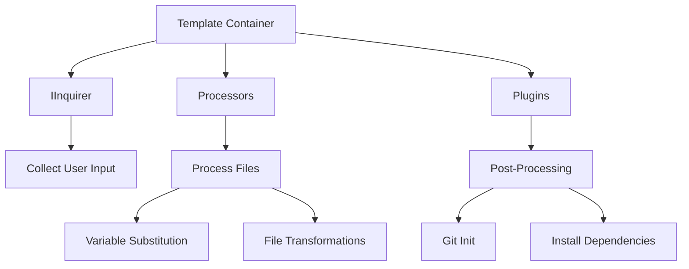

import { Callout } from 'fumadocs-ui/components/callout';

# Template Development

Templates are the core building blocks of CyanPrint. They define how projects are scaffolded, from simple file copying to complex multi-step generators with user interactions.

## What is a Template?

A CyanPrint template is a Docker container that:

1. **Asks questions** to collect user preferences
2. **Processes files** using variable substitution
3. **Generates output** in the target directory

Templates can range from simple static file copiers to sophisticated generators with conditional logic, multiple processors, and plugin integrations.

## Template Architecture



### Components

| Component | Purpose | Examples |
|-----------|---------|----------|
| **index.ts** | Template logic entry point | Question handling, config generation |
| **Processors** | File processing engines | `cyan/default`, custom processors |
| **Plugins** | Post-generation actions | Git initialization, dependency installation |
| **Template Files** | Source files to process | `.md`, `.ts`, `.json` templates |

## Learning Path

### Start Here: Tutorials

Follow the tutorials to learn template development step by step:

1. [Blank Template](/developer/templates/tutorials/01-blank-template) - Create your first template
2. [Adding Variables](/developer/templates/tutorials/02-adding-variables) - Add variable substitution
3. [Changing Glob Patterns](/developer/templates/tutorials/03-changing-glob) - Control file processing
4. [Asking Questions](/developer/templates/tutorials/04-asking-questions) - Collect user input

<Callout type="info">
New to CyanPrint? Start with the [Developer Basics](/developer/basics) to understand the platform architecture.
</Callout>

### How-To Guides

Task-oriented guides for common scenarios:

- [Ask Checkbox Questions](/developer/templates/how-to/ask-checkbox)
- [Ask Confirm Questions](/developer/templates/how-to/ask-confirm)
- [Ask Password Questions](/developer/templates/how-to/ask-password)
- [Validate User Input](/developer/templates/how-to/validate-input)
- [Push to Registry](/developer/templates/how-to/push-to-registry)
- [Add Plugins](/developer/templates/how-to/add-plugins)

[View all How-To Guides](/developer/templates/how-to)

### Reference

Technical documentation for the SDK:

- [IInquirer API](/developer/templates/reference/sdk/inquirer) - All question types
- [Cyan Config](/developer/templates/reference/sdk/cyan-config) - Configuration structure
- [Globbing Patterns](/developer/templates/reference/sdk/globbing) - File matching syntax
- [Type Definitions](/developer/templates/reference/sdk/types) - SDK types

[View all Reference Docs](/developer/templates/reference)

### Explanation

Deep dives into concepts and architecture:

- [Determinism](/developer/templates/explanation/determinism) - How reproducible generation works
- [Default Processor](/developer/templates/explanation/default-processor) - Eta templating explained
- [Container Paths](/developer/templates/explanation/container-paths) - Path mechanics in containers

[View all Explanations](/developer/templates/explanation)

## Quick Example

Here's a minimal template that asks for a project name and generates a README:

```ts
import { StartTemplateWithLambda, GlobType } from '@atomicloud/cyan-sdk';

StartTemplateWithLambda(async (i, d) => {
  // Ask user for project name
  const name = await i.text('Project name?', 'project.name', 'Enter project name');

  return {
    processors: [{
      name: 'cyan/default',
      files: [{ root: 'templates', glob: '**/*', exclude: [], type: GlobType.Template }],
      config: { vars: { name } }
    }]
  };
});
```

Template file (`templates/README.md`):

```markdown
# var__name__

Welcome to your new project!
```

## Next Steps

- [Create your first template](/developer/templates/tutorials/01-blank-template)
- [Explore the SDK reference](/developer/templates/reference/sdk)
- [Learn about processors](/developer/processors)
