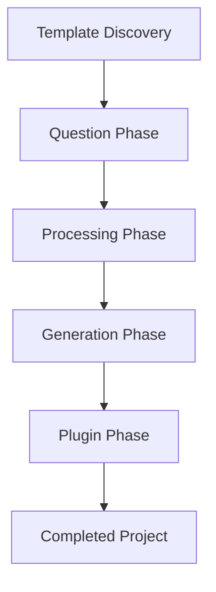

# CyanPrint Phases

CyanPrint operates through a series of distinct phases when creating a new project from a template. Understanding these phases helps you better comprehend how CyanPrint works and how to troubleshoot any issues that might arise.

## Overview of Phases

The CyanPrint workflow consists of the following phases:

1. **Template Discovery** - Finding and selecting a template
2. **Question Phase** - Gathering user input through interactive prompts
3. **Processing Phase** - Transforming the template based on user answers
4. **Generation Phase** - Creating the project files
5. **Plugin Phase** - Running optional post-generation actions

Let's explore each phase in detail.

## 1. Template Discovery

During this phase, CyanPrint:

- Searches for the requested template in the registry
- Verifies template availability and version
- Downloads the template to a local cache

This phase occurs when you run commands like:

```bash
cyan new template-name
```

<Callout type="info">
  If you're using a specific version of a template, CyanPrint will verify that the version exists before proceeding.
</Callout>

## 2. Question Phase

In this phase, CyanPrint:

- Loads the template's question definitions
- Presents interactive prompts to the user
- Validates user inputs
- Stores answers for use in subsequent phases

The questions are defined by the template author and can include various input types such as:
- Text input
- Yes/no questions
- Multiple choice selections
- Password inputs
- Date selections

<Callout type="tip">
  You can navigate back to previous questions during this phase using the arrow keys or by typing `back`.
</Callout>

## 3. Processing Phase

During the processing phase, CyanPrint:

- Applies the user's answers to the template
- Executes processors that transform template files
- Resolves conditional logic in the template
- Prepares the final file structure

Processors are components that define rules for transforming template files based on user inputs. They can:
- Modify file contents
- Rename files
- Include or exclude files based on conditions
- Transform data formats

## 4. Generation Phase

In this phase, CyanPrint:

- Creates the project directory structure
- Writes all processed files to disk
- Sets appropriate file permissions
- Initializes version control (if specified)

This is when your project actually takes shape on your filesystem.

## 5. Plugin Phase

The final phase involves:

- Running any plugins specified by the template
- Performing post-generation actions
- Setting up dependencies
- Initializing the project

Plugins can perform actions such as:
- Installing dependencies
- Running initialization scripts
- Setting up configuration files
- Executing arbitrary commands

<Callout type="warning">
  Plugins may require additional permissions or dependencies to run successfully. CyanPrint will prompt for permission before executing potentially sensitive operations.
</Callout>

## Phase Interaction

These phases work together to create a seamless experience:



Understanding these phases can help you:
- Troubleshoot issues during project creation
- Create more effective templates (if you're a template developer)
- Understand how your inputs affect the final project

## Related Concepts

- [Registry](/docs/user/concepts/01_registry) - How CyanPrint stores and retrieves templates
- [Coordinator](/docs/user/concepts/02_coordinator) - How CyanPrint orchestrates the template execution
- [Template Upgrades](/docs/user/concepts/03_template-upgrades) - How templates are versioned and upgraded
