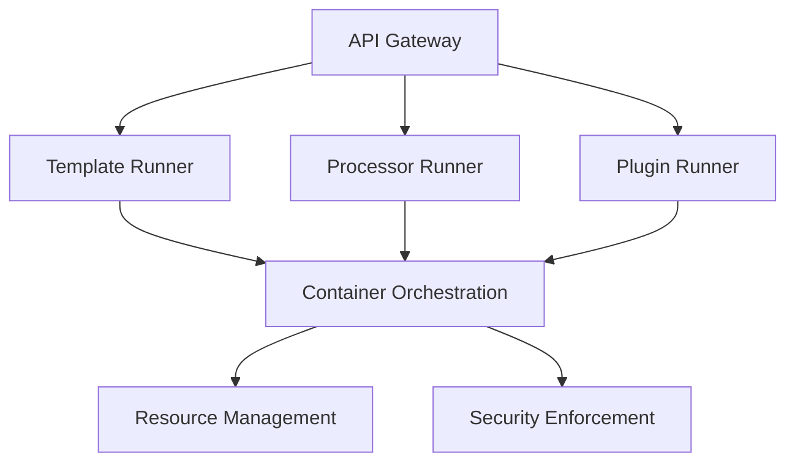

import { Tab, Tabs } from 'fumadocs-ui/components/tabs';

# CyanPrint Coordinator

The Coordinator is a critical component in the CyanPrint ecosystem that orchestrates the execution of templates, processors, and plugins. This document explains what the Coordinator is, how it works, and why it's important for CyanPrint users.

## What is the Coordinator?

The Coordinator (Boron) is a service that:

- Manages the execution environment for templates, processors, and plugins
- Provides a consistent interface for running components
- Handles resource allocation and isolation
- Ensures security and reliability during execution

<Callout type="info">
  While the Coordinator works behind the scenes, understanding its role helps you troubleshoot issues and configure CyanPrint for advanced use cases.
</Callout>

## How the Coordinator Works

When you run a CyanPrint command like `cyan new template-name`, the following process occurs:

1. The CLI (Iridium) contacts the Registry to find the requested template
2. The Registry provides metadata about the template, including its processors and plugins
3. The CLI sends a request to the Coordinator to execute the template
4. The Coordinator:
   - Creates isolated environments for each component
   - Executes the template's question phase
   - Passes user answers to processors
   - Generates the project files
   - Runs any specified plugins
5. The CLI receives the results and creates the project locally

<Tabs items={['Standard Flow', 'Custom Coordinator', 'Local Development']}>
  <Tab value="Standard Flow">
    In the standard flow, CyanPrint uses the default public Coordinator at `coordinator.cyanprint.dev`. This provides:
    
    - High availability and reliability
    - Automatic updates and maintenance
    - Consistent performance
    
    Most users never need to change this configuration.
  </Tab>
  
  <Tab value="Custom Coordinator">
    For organizations or advanced users, CyanPrint supports using a custom Coordinator:
    
    - Self-hosted within your infrastructure
    - Configured with specific resource limits
    - Connected to private registries
    - Customized for specific security requirements
    
    See [Use Custom Coordinator](/docs/user/recipes/custom-coordinator) for setup instructions.
  </Tab>
  
  <Tab value="Local Development">
    For template developers or offline use, CyanPrint can use a local Coordinator:
    
    - Runs directly on your machine
    - Useful for testing templates during development
    - Works without internet connectivity
    - Provides detailed debugging information
    
    See [Setup Custom Coordinator (Local)](/docs/user/recipes/local-coordinator) for setup instructions.
  </Tab>
</Tabs>

## Coordinator Architecture

The Coordinator is built as a containerized service with several key components:



This architecture provides:

- **Isolation**: Each component runs in its own container
- **Resource Control**: Prevents runaway processes from consuming excessive resources
- **Security**: Limits the permissions of each component
- **Scalability**: Handles multiple requests efficiently

## Coordinator Configuration

CyanPrint allows you to configure which Coordinator to use:

```bash
# View current Coordinator configuration
cyan config get coordinator

# Set a custom Coordinator
cyan config set coordinator https://my-custom-coordinator.example.com

# Reset to default Coordinator
cyan config reset coordinator
```

<Callout type="warning">
  Changing the Coordinator affects all CyanPrint operations. Only use custom Coordinators from trusted sources.
</Callout>

## When to Use a Custom Coordinator

Consider using a custom Coordinator in these scenarios:

- **Enterprise Environments**: For organizations with specific security or compliance requirements
- **Air-gapped Networks**: When operating in environments without internet access
- **Custom Templates**: When developing templates that require specific runtime environments
- **Performance Optimization**: For high-volume template usage with specific resource needs

## Related Concepts

- [Phases](/docs/user/concepts/00_phases) - How CyanPrint processes templates
- [Registry](/docs/user/concepts/01_registry) - How CyanPrint stores and retrieves templates
- [Template Upgrades](/docs/user/concepts/03_template-upgrades) - How templates are versioned and upgraded

## Related Recipes

- [Setup Custom Coordinator (Local)](/docs/user/recipes/local-coordinator)
- [Use Custom Coordinator](/docs/user/recipes/custom-coordinator)
