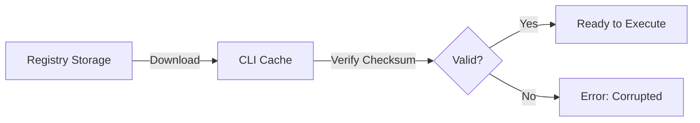

# Template Lifecycle

This guide explains what happens when you run a template, how templates are versioned, and how the platform ensures secure, reproducible project generation.

## Overview

When you run `cyanprint init`, a sophisticated process unfolds:

1. The CLI resolves your template request
2. The template is downloaded and verified
3. An isolated container is prepared
4. The template executes in the sandbox
5. Generated files are delivered to your machine

Understanding this process helps you:

- Troubleshoot issues when they arise
- Make informed decisions about templates
- Appreciate the security model

## Execution Flow

### Step 1: Command Parsing

When you run:

```bash
cyanprint init my-project --template nextjs-dashboard
```

The CLI parses:

- **Project name**: `my-project` (the output directory)
- **Template reference**: `nextjs-dashboard`
- **Additional options**: Flags and their values

If no template is specified, the CLI enters interactive mode, prompting you to select from available templates.

### Step 2: Template Resolution

The CLI queries the registry to resolve the template reference:

```
CLI → Registry: "Get template 'nextjs-dashboard'"
Registry → CLI: { name: "nextjs-dashboard", version: "2.1.0", ... }
```

This includes:

- **Metadata**: Name, description, author, tags
- **Latest version**: The most recent stable release
- **Available versions**: All published versions
- **Container image**: The Docker image to use

<Callout type="info">
You can specify a version explicitly with `--template-version 2.0.0` or `--template nextjs-dashboard@2.0.0`. Without this, the latest version is used.
</Callout>

### Step 3: Download and Verification

The template package is downloaded from the registry's storage (MinIO):

1. **Download**: Template archive is fetched
2. **Checksum verification**: SHA-256 hash is validated
3. **Signature verification**: If signed, cryptographic signature is checked
4. **Cache**: Template is cached locally for future offline use



### Step 4: Container Preparation

CyanPrint uses Docker to run templates in isolated containers:

1. **Image pull**: The template's Docker image is pulled (or reused if cached)
2. **Container create**: A new container is created with:
   - Resource limits (CPU, memory)
   - Network policies (isolated or specific access)
   - Volume mounts (for file transfer)
   - Environment variables (user inputs)

3. **Container start**: The container starts running

<Callout type="warn">
Docker is required because templates execute arbitrary code. The container isolation protects your system from potentially malicious or buggy templates.
</Callout>

### Step 5: Input Collection

Before execution, the CLI collects your configuration choices:

1. **Prompt definition**: The template defines what inputs it needs
2. **Interactive prompts**: CLI displays prompts to you
3. **Validation**: Your inputs are validated against rules
4. **Defaults**: Unanswered prompts use default values

Example prompts:

```
? Project name: (my-project)
? Database: PostgreSQL
? Add authentication? Yes
? Choose a package manager: npm
```

These inputs are passed to the template as environment variables or configuration files.

### Step 6: Template Execution

Inside the container, the template engine runs:

1. **Initialize**: Template SDK (Helium) loads
2. **Process inputs**: User choices are made available
3. **Generate files**: Template logic creates files
4. **Apply processors**: Transformers modify generated content
5. **Write output**: Files are written to the shared volume

The template can:

- Create directories and files
- Run shell commands (within the container)
- Install dependencies
- Initialize git repositories

<Callout type="info">
Templates are built using the Helium SDK, available in TypeScript, Python, and .NET. The SDK provides utilities for file generation, user prompts, and conditional logic.
</Callout>

### Step 7: Output Delivery

After execution completes:

1. **Container stops**: Execution finished
2. **Files copied**: Generated files are copied from container to your host
3. **Cleanup**: Container is removed
4. **Success message**: CLI reports completion

Your project is now ready in the specified directory.

## Template Versioning

### Semantic Versioning

Templates follow [Semantic Versioning](https://semver.org/):

- **MAJOR** (X.0.0): Breaking changes
- **MINOR** (0.X.0): New features, backward compatible
- **PATCH** (0.0.X): Bug fixes

### Version Resolution

When you run a template without specifying a version:

```bash
cyanprint init my-project -t nextjs-dashboard
```

The CLI:

1. Queries the registry for the latest version
2. Checks your cache for that version
3. Downloads if not cached
4. Uses that version for execution

### Version Pinning

For reproducibility, you can pin to a specific version:

```bash
# In the project
cyanprint pin --version 2.1.0
```

This creates a `.cyanprint` file in your project:

```json
{
  "template": "nextjs-dashboard",
  "version": "2.1.0",
  "pinned": true
}
```

### Version Ranges

Some commands support version ranges:

```bash
# Any 2.x version
cyanprint init -t nextjs-dashboard@2

# At least 2.1.0
cyanprint init -t "nextjs-dashboard@>=2.1.0"
```

## Registry Storage

### How Templates Are Stored

Templates are stored in the registry with:

| Component    | Storage                                  |
| ------------ | ---------------------------------------- |
| **Package**  | MinIO (object storage)                   |
| **Metadata** | PostgreSQL (relational database)         |
| **Cache**    | Redis (fast lookup)                      |

### Distribution

Templates are distributed globally through:

- **CDN**: Fast delivery from edge locations
- **Regional mirrors**: Reduced latency
- **Checksums**: Integrity verification

### Retention

Version retention policies:

- **All versions**: Kept indefinitely (unless yanked)
- **Yanked versions**: Unavailable for new projects
- **Deprecated versions**: Available but flagged

## Execution Sandboxing

### Security Model

CyanPrint's sandbox protects your machine:

| Protection      | Implementation                           |
| --------------- | ---------------------------------------- |
| **Isolation**   | Docker containers                        |
| **Network**     | Disabled by default                      |
| **Filesystem**  | No host access except output directory   |
| **Resources**   | CPU and memory limits                    |
| **Timeout**     | Execution time limit (default: 5 min)    |

### What Templates Can Do

Inside the container, templates can:

- Create files and directories
- Run shell commands
- Install packages (in container only)
- Make network requests (if permitted)

### What Templates Cannot Do

Templates **cannot**:

- Access your host filesystem (except output)
- Read environment variables not explicitly passed
- Access network unless explicitly permitted
- Run beyond timeout limits
- Exceed resource limits

<Callout type="warn">
Only use templates from trusted sources. While the sandbox provides protection, running untrusted code always carries some risk.
</Callout>

### Network Access

By default, templates run without network access. Some templates request network access for:

- Downloading dependencies
- Fetching configuration
- API calls

Network access requires:

1. Template to declare network requirement
2. User to approve (or use `--allow-network` flag)

```bash
# Approve network access during init
cyanprint init my-project -t template-with-network --allow-network
```

## Caching

### Local Cache

The CLI caches templates locally:

- **Location**: `~/.cyanprint/cache/`
- **TTL**: 24 hours by default
- **Size limit**: Configurable

### Cache Benefits

- **Offline use**: Run cached templates without internet
- **Speed**: Skip download for repeated use
- **Bandwidth**: Reduce registry load

### Cache Management

```bash
# List cached templates
cyanprint cache list

# Clear cache
cyanprint cache clear

# Use specific cache directory
CYANPRINT_CACHE_DIR=/custom/path cyanprint init ...
```

## Summary

The template lifecycle ensures:

| Property         | How Achieved                             |
| ---------------- | ---------------------------------------- |
| **Security**     | Docker sandboxing                        |
| **Reproducibility** | Versioning and caching                |
| **Performance**  | Caching and CDN distribution             |
| **Reliability**  | Checksum verification                    |

## Next Steps

- [CLI Commands](./06-cli-commands) - Learn all CLI options
- [Update Projects](./05-update-templates) - Keep projects synchronized
- [Developer Docs](/docs/developer) - Create your own templates
