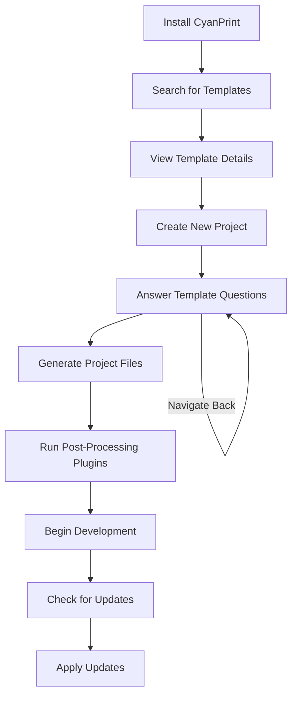

# CyanPrint User Flow

This reference document outlines the typical flow a user follows when working with CyanPrint, from installation to project creation and beyond.

## Overview

The CyanPrint user flow consists of several key stages:

1. **Installation** - Installing the CyanPrint CLI
2. **Discovery** - Finding templates in the registry
3. **Creation** - Creating a project from a template
4. **Customization** - Answering questions to customize the project
5. **Generation** - Generating the project files
6. **Post-Processing** - Running plugins and finalizing the project
7. **Development** - Working with the generated project
8. **Updates** - Checking for and applying template updates

## Detailed Flow

### 1. Installation

The user begins by installing the CyanPrint CLI:

```bash
# Using Homebrew
brew install atomicloud/tap/cyan

# Or using direct download from GitHub
# See Installation tutorial for details
```

After installation, the user verifies the installation:

```bash
cyan --version
```

### 2. Discovery

The user searches for available templates:

```bash
# List all templates
cyan search

# Search for specific templates
cyan search react
```

The user can view detailed information about a template:

```bash
cyan info react-app
```

### 3. Creation

The user creates a new project using a selected template:

```bash
# Create a new project in a new directory
cyan new react-app my-project

# Or create a project in the current directory
cyan new react-app --here
```

### 4. Customization

The user answers a series of questions to customize the template:

```
? Project name: my-project
? Package manager: npm
? Include TypeScript? Yes
? Include testing framework? Yes
```

The user can navigate back to previous questions if needed:

```
? Include Redux? back
```

### 5. Generation

CyanPrint processes the template with the user's answers and generates the project files:

```
✓ Downloading template: react-app
✓ Processing template
✓ Generating files
```

### 6. Post-Processing

CyanPrint runs any plugins specified by the template:

```
✓ Running plugins
  - Installing dependencies
  - Initializing git repository
  - Setting up configuration
✓ Project created successfully!
```

### 7. Development

The user navigates to the project directory and begins development:

```bash
cd my-project
npm start
```

### 8. Updates

Later, the user can check for template updates:

```bash
# Navigate to the project directory
cd my-project

# Check for updates
cyan check-updates
```

If updates are available, the user can apply them:

```bash
cyan upgrade
```

## Flow Diagram



## Alternative Flows

### Using a Specific Template Version

```bash
cyan new react-app@1.2.3 my-project
```

### Using Multiple Templates

```bash
# Create base project
cyan new backend-template my-project

# Add frontend
cd my-project
cyan new frontend-template --here --target frontend
```

### Using a Custom Coordinator

```bash
# Set custom coordinator
cyan config set coordinator https://custom-coordinator.example.com

# Use CyanPrint as normal
cyan new template-name
```

## Common Issues and Solutions

| Issue | Solution |
| ----- | -------- |
| Template not found | Check the template name and registry connection |
| Network connectivity issues | Use `--offline` flag with cached templates |
| Conflicts when applying multiple templates | Apply templates to separate directories or resolve conflicts manually |
| Template execution errors | Check template compatibility and report issues to template author |
| Plugin execution failures | Check required dependencies and permissions |

## Related References

- [CLI Reference](/docs/user/reference/00_cli) - Detailed information about all CyanPrint commands
- [Glossary](/docs/user/reference/02_glossary) - Definitions of CyanPrint terminology

## Related Concepts

- [Phases](/docs/user/concepts/00_phases) - Understanding the different phases of CyanPrint
- [Registry](/docs/user/concepts/01_registry) - How CyanPrint stores and retrieves templates
- [Coordinator](/docs/user/concepts/02_coordinator) - How CyanPrint orchestrates template execution
