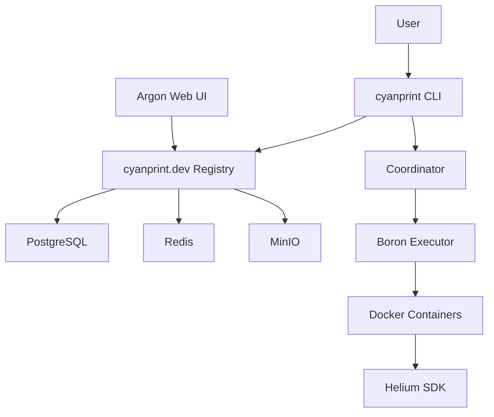

# Phase 1: Contributor Documentation

## Source

- Ticket: CU-86et8z80y
- Commit: `docs: add contributor architecture and repository index`

## CRITICAL: Verify Against Actual Code

Before writing ANY documentation:

1. Read actual repo files from ALL directories (not just docs):
   - `../zinc/`
   - `../argon/`
   - `../iridium/`
   - `../boron/`
   - `../helium/`
   - `../silicon/`
2. Check actual tech stacks from package.json, Cargo.toml, .csproj files
3. Verify all links work before including them
4. Ensure Mermaid diagrams are configured and work

## Objective

Create contributor documentation with architecture overview and repository index.

## Files to Create/Modify

| Action | File                                                    | Type        | Description                                                             |
| ------ | ------------------------------------------------------- | ----------- | ----------------------------------------------------------------------- |
| CREATE | `content/docs/contributor/00-architecture.mdx`          | Explanation | Platform architecture with Mermaid diagram, data flow, key technologies |
| CREATE | `content/docs/contributor/01-repositories.mdx`          | Reference   | Index of all repos with summaries, tech stacks, links to docs           |
| RENAME | `02_CommitConventions.md` → `02-commit-conventions.mdx` | Reference   | (existing file, just rename)                                            |
| RENAME | `03_Changelog.md` → `03-changelog.mdx`                  | Reference   | (existing file, just rename)                                            |

## 00-architecture.mdx Content

Create a comprehensive architecture page with:

1. **Platform Overview** - What CyanPrint is and why it exists
2. **Architecture Diagram** using Mermaid (VERIFY CONFIGURATION):

3. **Data Flow** - How a template is executed:

   - User runs `cyanprint create` command
   - CLI fetches template from cyanprint.dev registry
   - Coordinator (coord.cyanprint.dev:9000) creates execution plan
   - Boron runs template in isolated Docker container
   - Files are generated and copied to output

4. **Key Technologies** (VERIFY THESE from actual repos):

   - .NET 8 (Zinc - verify from ../zinc/)
   - SvelteKit (Argon - verify from ../argon/)
   - Rust (Iridium - verify from ../iridium/)
   - Docker (Boron - verify from ../boron/)
   - TypeScript/.NET/Python (Helium SDKs - verify from ../helium/)

5. **Repository Links** - Quick links to each repo

## 01-repositories.mdx Content

Create an index page with entries for each repo. READ ACTUAL FILES from `../` (ALL files, not just docs):

| Repo        | Language       | Purpose                               | Documentation              |
| ----------- | -------------- | ------------------------------------- | -------------------------- |
| **zinc**    | .NET 8         | Registry API                          | Link to ../zinc/README.md  |
| **argon**   | SvelteKit      | Registry Web UI (cyanprint.dev)       | Link to ../argon/README.md |
| **iridium** | Rust           | CLI (cyanprint command)               | Link to ../iridium/docs/   |
| **boron**   | Docker         | Isolated template execution           | Link to ../boron/README.md |
| **helium**  | TS/.NET/Python | SDKs for templates/processors/plugins | Link to ../helium/         |
| **silicon** | ?              | Silicon platform                      | Link to ../silicon/        |

Include:

- Brief description of each repo (from actual READMEs and source files)
- Tech stack details (from actual package.json, Cargo.toml, etc.)
- How they interact with each other
- Links to existing documentation (verify links work!)

## File Renames

Rename existing files for consistent numbering:

- `content/docs/contributor/02_CommitConventions.md` → `content/docs/contributor/02-commit-conventions.mdx`
- `content/docs/contributor/03_Changelog.md` → `content/docs/contributor/03-changelog.mdx`

## Verification

After completion:

1. Run `direnv exec . pls build` to verify build succeeds
2. Check that Mermaid diagrams render correctly
3. **VERIFY ALL LINKS WORK** - no broken links
4. Run `pre-commit run --all` to verify all checks pass

## Definition of Done

- [ ] Architecture page created with Mermaid diagram (verified working)
- [ ] Repository index page created with links (all verified)
- [ ] Existing files renamed with consistent numbering
- [ ] Build succeeds
- [ ] All content verified against actual repo files
- [ ] pre-commit run --all passes
