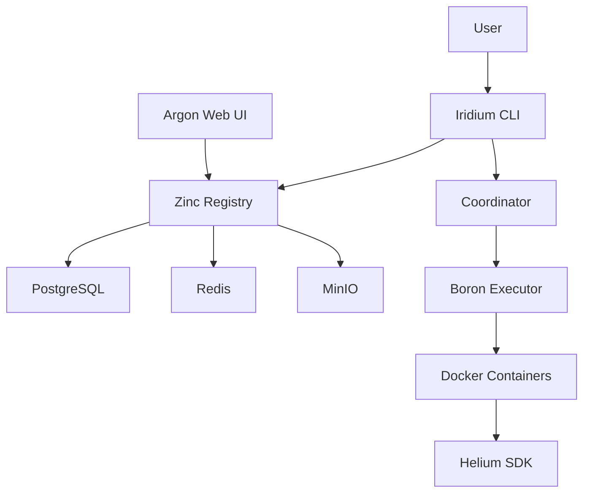

# Phase 1: Contributor Documentation

## Source

- Ticket: CU-86et8z80y
- Commit: `docs: add contributor architecture and repository index`

## Objective

Create contributor documentation with architecture overview and repository index.

## Files to Create/Modify

| Action | File                                                    | Type        | Description                                                             |
| ------ | ------------------------------------------------------- | ----------- | ----------------------------------------------------------------------- |
| CREATE | `content/docs/contributor/01-architecture.mdx`          | Explanation | Platform architecture with Mermaid diagram, data flow, key technologies |
| CREATE | `content/docs/contributor/02-repositories.mdx`          | Reference   | Index of all 5 repos with summaries, tech stacks, links to docs         |
| RENAME | `02_CommitConventions.md` → `03-commit-conventions.mdx` | Reference   | (existing file, just rename)                                            |
| RENAME | `03_Changelog.md` → `04-changelog.mdx`                  | Reference   | (existing file, just rename)                                            |

## 01-architecture.mdx Content

Create a comprehensive architecture page with:

1. **Platform Overview** - What CyanPrint is and why it exists
2. **Architecture Diagram** using Mermaid:

3. **Data Flow** - How a template is executed:

   - User runs CLI command
   - CLI fetches template from registry
   - Coordinator creates execution plan
   - Boron runs template in isolated Docker container
   - Files are generated and copied to output

4. **Key Technologies**:

   - .NET 8 (Zinc)
   - SvelteKit (Argon)
   - Rust (Iridium)
   - Docker (Boron)
   - TypeScript/.NET/Python (Helium SDKs)

5. **Repository Links** - Quick links to each repo

## 02-repositories.mdx Content

Create an index page with:

| Repo        | Language       | Purpose                                             | Documentation              |
| ----------- | -------------- | --------------------------------------------------- | -------------------------- |
| **zinc**    | .NET 8         | Registry API (PostgreSQL, Redis, MinIO)             | Link to ../zinc/README.md  |
| **argon**   | SvelteKit      | Registry Web UI                                     | Link to ../argon/README.md |
| **iridium** | Rust           | Main CLI (cyanprint, coordinator, prompt, registry) | Link to ../iridium/docs/   |
| **boron**   | Docker         | Isolated template execution                         | Link to ../boron/README.md |
| **helium**  | TS/.NET/Python | SDKs for templates, processors, plugins             | Link to ../helium/         |

Include:

- Brief description of each repo
- Tech stack details
- How they interact with each other
- Links to existing documentation

## File Renames

Rename existing files for consistent numbering:

- `content/docs/contributor/02_CommitConventions.md` → `content/docs/contributor/03-commit-conventions.mdx`
- `content/docs/contributor/03_Changelog.md` → `content/docs/contributor/04-changelog.mdx`

## Verification

After completion:

1. Run `direnv exec . pls build` to verify build succeeds
2. Check that Mermaid diagrams render correctly
3. Verify all links to external repos work

## Definition of Done

- [ ] Architecture page created with Mermaid diagram
- [ ] Repository index page created with links
- [ ] Existing files renamed with consistent numbering
- [ ] Build succeeds
